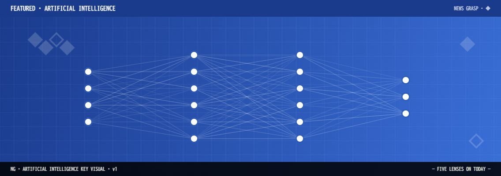
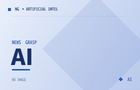

# ◆ 2. AI (Artificial Intelligence)

> [!summary]
> Google が Anthropic へ最大 400 億ドルを投じた週、NVIDIA が時価総額 5 兆ドルを突破し、元 DeepMind 研究者が史上最大 11 億ドルのシード調達に成功。AI 覇権争いは「二極構造」から「連合体形成」という新フェーズへ突入した。

---

### [95] Google が Anthropic に最大 400 億ドル追加投資 10 億即時 + 30 億条件付き

📅 2026-04-28 09:00 · 📰 CNBC · 🔗 [元記事](https://www.cnbc.com/2026/04/24/google-to-invest-up-to-40-billion-in-anthropic-as-search-giant-spreads-its-ai-bets.html)

#cat/ai #co/Amazon #co/Anthropic #co/Google #co/Microsoft #country/米国 #event/出資発表 #industry/AI #svc/Claude #ticker/GOOGL #topic/AI投資 #topic/AI覇権 #topic/Big-Three #score/高

- [[Google]] が [[Anthropic]] へ最大 400 億ドルの追加出資を発表。即時 100 億ドル投入、残り 300 億ドルは成果条件付き。2026 年 Q1 の AI 投資案件として過去最大規模。
- これにより Anthropic の主要株主に Google と Amazon が並立する構図が鮮明化。__OpenAI と Anthropic の二極構造__ が業界の地政学を塗り替えつつある。
- 36kr の分析では「[[Big Three 時代]]の終焉」と表現。Microsoft/OpenAI 陣営に対し Google/Anthropic 連合が対抗軸として台頭。

---

### [92] 元 DeepMind 研究者のスタートアップ 史上最大 11 億ドルのシード調達に成功

📅 2026-04-28 08:30 · 📰 CNBC · 🔗 [元記事](https://www.cnbc.com/2026/04/27/deepmind-ineffable-intelligence-record-seed-funding-nvidia-google.html)

#cat/ai #co/Google #co/Google-DeepMind #co/Ineffable-Intelligence #co/NVIDIA #country/米国 #event/資金調達 #industry/AI #ticker/NVDA #topic/AI資金調達 #topic/スタートアップ #topic/超知性 #score/高

- 元 [[Google DeepMind]] 研究者が設立した「Ineffable Intelligence」が NVIDIA・Google バックで [[11 億ドル]] のシード調達に成功。超知性（superintelligence）追求を旗印にする。
- シード段階として世界記録。AI 分野への資金集中が加速しており、__一次情報を持つ研究者__ が最高のブランドになった時代を象徴。
- 調達先に NVIDIA が入ることで、[[推論チップ]] の供給保証と研究戦略が一体化する新モデルが確立しつつある。

---

### [90] OpenAI GPT-5.5 / GPT-5.5 Pro API リリース 4 月 24 日

📅 2026-04-28 07:00 · 📰 OpenAI · 🔗 [元記事](https://openai.com/index/introducing-gpt-5-5/)

#cat/ai #co/OpenAI #country/米国 #event/製品発表 #industry/AI #svc/GPT-5_5 #svc/GPT-5_5-Pro #svc/ワークスペースエージェント #topic/AIエージェント #topic/ARR #topic/LLM #topic/マルチモーダル #score/高

- [[OpenAI]] が GPT-5.5 および GPT-5.5 Pro を API 経由でリリース（4 月 24 日）。エージェント的推論とマルチモーダル処理が大幅強化。
- 企業向け [[ワークスペースエージェント]] 機能も同時発表。Slack 連携・承認フロー・メモリ機能が統合され、__AI が業務ワークフローに深く入り込む__ 設計。
- 年内 IPO を目指す OpenAI にとって、エンタープライズ収益基盤の強化が最優先事項。[[ARR]] は既に 300 億ドルを超えた。

---

### [88] OpenAI IPO 準備 Robinhood でリテール投資家向け株式割り当て

📅 2026-04-28 09:30 · 📰 CNBC · 🔗 [元記事](https://www.cnbc.com/2026/04/08/openai-ipo-sarah-friar-retail-investors.html)

#cat/ai #co/OpenAI #co/Robinhood #country/米国 #event/IPO準備 #industry/AI #industry/金融 #person/Sarah-Friar #topic/ARR #topic/IPO #topic/評価額 #score/高

- [[OpenAI]] CFO Sarah Friar が CNBC に対し、IPO 時にリテール投資家向け株式枠を用意すると明言。Robinhood 経由の事前購入も開始。
- 評価額は [[7,300 億ドル]] 超。年間売上 250 億ドル以上、[[MAU 8 億 1,000 万人]] を背景に 2026 年 Q4 の上場を目標とする。
- AI 資金調達フレンジーのピークを象徴するとの批判もあるが、__収益成長率がトリプルディジット__ を維持している間は IPO バリュエーションの根拠が崩れない。

---

### [85] NVIDIA 時価総額 5 兆ドル突破 4 月 24 日に 208.27 ドル

📅 2026-04-28 07:30 · 📰 The Motley Fool · 🔗 [元記事](https://www.fool.com/coverage/stock-market-today/2026/04/24/stock-market-today-april-24-nvidia-surges-on-soaring-ai-chip-demand/)

#cat/ai #co/Amazon #co/Google #co/Meta #co/Microsoft #co/NVIDIA #country/米国 #event/株価更新 #industry/AI #industry/半導体 #ticker/NVDA #topic/AI投資 #topic/データセンター #topic/半導体 #topic/時価総額 #score/高

- [[NVIDIA]] が時価総額 [[5 兆ドル]] を突破（4 月 24 日）。月間上昇率 19%、半導体 ETF は同期間 40.4% 上昇。需要はデータセンター・クラウド・エンタープライズ AI 構築から。
- ハイパースケーラー（Microsoft、Google、Amazon、Meta）が 2026 年の AI インフラに総額 [[6,500 億ドル]] をコミット。NVIDIA GPU が事実上の標準。
- AMD も強く、DA Davidson がアップグレード後に 14% 急騰。__AI チップの寡占からデュオポリへ__ の移行期が始まりつつある。

---

### [83] Anthropic Project Glasswing サイバーセキュリティ協定 Claude Mythos 5

📅 2026-04-28 10:00 · 📰 CNBC · 🔗 [元記事](https://www.cnbc.com/2026/04/17/ai-tokens-anthropic-openai-nvidia.html)

#cat/ai #co/Amazon #co/Anthropic #co/Apple #co/Google #co/Microsoft #co/NVIDIA #country/米国 #event/協定発表 #industry/AI #industry/セキュリティ #svc/Claude-Mythos-5 #svc/Project-Glasswing #topic/AI安全 #topic/コンソーシアム #topic/サイバーセキュリティ #score/中

- [[Anthropic]] が「Project Glasswing」を発表。Amazon・Microsoft・Apple・Google・NVIDIA が参加し、[[Claude Mythos 5]]（1 兆パラメータ）を防衛的サイバーセキュリティに活用するコンソーシアム。
- 既に数千の脆弱性を特定済みで、__AI を攻撃ではなく防御に使う__ 最初の本格的な多国籍産業連合。
- Anthropic 自身が「AI 需要は過熱気味」と発言している点が異彩を放つ。市場の過剰期待に警鐘を鳴らす姿勢が投資家の注目を集めている。

---

### [80] Google TPU 8t/8i 2 チップ発表 NVIDIA に対抗

📅 2026-04-28 09:15 · 📰 Yahoo Finance · 🔗 [元記事](https://finance.yahoo.com/sectors/technology/article/google-announces-2-ai-chips-as-competition-with-nvidia-heats-up-120011883.html)

#cat/ai #co/Google #co/NVIDIA #country/米国 #event/製品発表 #industry/AI #industry/半導体 #svc/Google-Cloud #svc/TPU-8i #svc/TPU-8t #ticker/GOOGL #ticker/NVDA #topic/AIチップ #topic/半導体 #topic/圧縮アルゴリズム #score/中

- [[Google]] が Google Cloud Next 2026 で [[TPU 8t]] と [[TPU 8i]] の 2 種を発表。NVIDIA へのチップ依存脱却を加速する戦略。
- TPU 8t はトレーニング特化、TPU 8i は推論特化の分業設計。__コスト削減率を従来比 6 倍__ の圧縮アルゴリズムと組み合わせることで ROI を最大化。
- Google が独自チップでクラウドの垂直統合を深めると、他のハイパースケーラーも追随を余儀なくされ、NVIDIA の外販比率に影響を与え得る。

---

### [78] Google AI Agents 企業向けツール群 OpenAI・Anthropic に対抗

📅 2026-04-28 08:00 · 📰 Bloomberg · 🔗 [元記事](https://www.bloomberg.com/news/articles/2026-04-22/google-releases-new-ai-agents-to-challenge-openai-and-anthropic)

#cat/ai #co/Anthropic #co/Google #co/OpenAI #country/米国 #event/製品発表 #industry/AI #svc/AI-Agents #svc/Gemini-3_1 #svc/Google-Workspace #ticker/GOOGL #topic/AIエージェント #topic/企業向けAI #score/中

- [[Google]] が 4 月 22 日、企業の業務自動化を担う [[AIエージェント]] 構築ツール群を発表。タスク追跡・承認フロー・分析機能を標準搭載。
- OpenAI と Anthropic に対し、Google Workspace との深い統合が差別化ポイント。__「エコシステムでの占有率」競争__ が次の戦場になったことを明示。
- Gemini 3.1 のリアルタイム音声・画像分析を土台に、エージェントが会議・メール・スプレッドシートを横断処理できる設計。

---

### [75] AMD 5 月決算前に 14% 上昇 AI チップ競争の第 2 極へ

📅 2026-04-28 07:30 · 📰 24/7 Wall St. · 🔗 [元記事](https://247wallst.com/investing/2026/04/16/amd-gains-6-ahead-of-may-earnings-is-the-ai-chip-challenger-finally-ready-to-rival-nvidia/)

#cat/ai #co/AMD #co/NVIDIA #country/米国 #event/株価更新 #industry/AI #industry/半導体 #svc/MI350X #ticker/AMD #ticker/NVDA #topic/AIチップ #topic/デュオポリ #topic/半導体 #score/中

- [[AMD]] が 5 月 5 日の Q1 2026 決算前に 14% 急騰（349.54 ドル）。DA Davidson がアップグレードし AI チップ市場での地位確立を評価。
- 売上予想 98.4 億ドル（前年比 33% 増 EPS）。__MI350X GPU__ がクラウド大手のサーバー採用率を高めており、NVIDIA の市場支配に初めて本格的な楔を打ち込んでいる。
- 半導体産業全体が 3 年連続の [[二桁成長]] フェーズに突入。2026 年末には業界規模が 1 兆ドル超に達する見通し。

---

### [72] Google DeepMind Gemini 3.1 リアルタイム音声・画像分析を追加

📅 2026-04-28 07:15 · 📰 LLM Stats · 🔗 [元記事](https://llm-stats.com/llm-updates)

#cat/ai #co/Google #co/Google-DeepMind #country/米国 #event/製品発表 #industry/AI #svc/Claude #svc/GPT-5 #svc/Gemini-3_1 #ticker/GOOGL #topic/LLM #topic/マルチモーダル #topic/圧縮アルゴリズム #score/中

- [[Google DeepMind]] が [[Gemini 3.1]] を発表。リアルタイム音声・画像の同時分析機能を追加し、マルチモーダル推論の粒度が大幅向上。
- 6 倍の圧縮アルゴリズムと組み合わせることで、同等精度を従来の 1/6 のメモリで実現。__「精度か速度か」のトレードオフを無効化__ するアプローチ。
- Gemini シリーズは Anthropic Claude および OpenAI GPT-5 系と並ぶ「三強」の一角として、企業導入の選択肢が三択化した。

---

*🤖 Auto-generated by News-Grasp Runner — 2026-04-28 Morning Edition*
