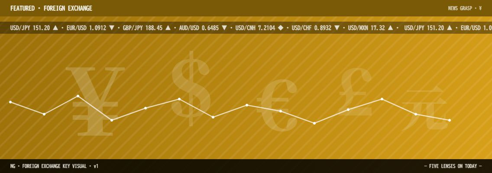
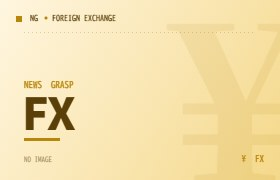

# ¥ 1. 為替 (Foreign Exchange)

> [!summary]
> BOJ・FOMC が同週開催というレアイベント週に突入。USD/JPY は 159.42 円と 160 円の防衛ラインを意識しつつ、イラン停戦協議の行方と本日 15:30 の日銀総裁会見に市場が釘付けになっている。

---

### [92] BOJ・FOMC 同週開催 USD/JPY 159.42 — 日銀記者会見 15:30 に注目

📅 2026-04-28 08:00 · 📰 三井住友銀行 市場コメント · 🔗 [元記事](https://www.smbc.co.jp/market/pdf/comment.pdf)

#cat/fx #country/日本 #country/米国 #event/記者会見 #event/政策会合 #person/植田和男 #ticker/USDJPY #topic/FOMC #topic/利上げ #topic/日銀 #topic/金融政策 #score/高

- [[USD/JPY]] は 159.42 円、日中レンジ 159.10〜159.67 で推移。__イランの停戦提案__ が安全資産ドル買いを後退させ、円安の勢いがやや一服。
- 本日 15:30 に [[日銀植田総裁]] 記者会見が予定。政策据え置きはほぼ織り込み済みで、__6 月利上げ期待の消長__ が最大の焦点。
- 来週の [[FOMC]] を控え市場は様子見モード。原油高持続がインフレ再燃懸念を維持し、FRB の早期利下げ観測を圧迫している。

---

### [88] 160 円防衛ライン 財務省の口先介入が上値を抑制

📅 2026-04-28 09:30 · 📰 IG Group · 🔗 [元記事](https://www.ig.com/jp/news-and-trade-ideas/jpy-may-be-weaken-after-boj-meeting-as-usd-gets-stronger-again-260424)

#cat/fx #country/日本 #country/米国 #event/口先介入 #ticker/USDJPY #topic/ホルムズ海峡 #topic/為替介入 #topic/財務省 #score/高

- [[160 円]] 水準が事実上の防衛ラインとなり、財務省・財務官が「[[断固たる措置]]」発言で口先介入を実施中。
- 日銀会合後の政策据え置き確認で、__円安が再加速するリスク__ が意識される。市場は即時介入への備えを強める。
- ホルムズ海峡の緊張継続が原油価格を高止まりさせ、日本の [[交易条件悪化]] が円安圧力の根本要因として機能している。

---

### [85] FRB FFレート 3.50〜3.75% 維持 年内 2 回利下げ予想

📅 2026-04-28 07:00 · 📰 OANDA · 🔗 [元記事](https://www.oanda.jp/lab-education/beginners/fundamentals_analysis/fomc-meeting/)

#cat/fx #co/野村証券 #country/米国 #event/政策会合 #industry/金融 #topic/FOMC #topic/FRB #topic/利下げ #topic/金融政策 #score/高

- [[FOMC]] は今週開催、現行 FFレート 3.50〜3.75% を据え置く見通し。市場コンセンサスは年内 2 回の利下げだが、__原油高次第でゼロも__ の声が増加。
- [[FRB]] の新議長体制が本格的に動き始めた 2026 年、政策コミュニケーションの変化が市場のボラティリティを高める。
- 野村証券の試算では [[S&P500]] 年末 7,300 予想で、FRB 議長交代をカタリストに据えている。

---

### [82] 野村証券 ドル円年末 152.5 円見通し引き上げ 中東情勢が主因

📅 2026-04-28 10:00 · 📰 野村証券 · 🔗 [元記事](https://www.nomura.co.jp/wealthstyle/article/0676/)

#cat/fx #co/野村証券 #country/日本 #country/米国 #event/見通し公表 #industry/金融 #ticker/USDJPY #topic/ヘッジファンド #topic/中東 #topic/為替見通し #score/中

- 野村証券の後藤アナリストが 2026 年末の [[USD/JPY]] 見通しを 152.5 円に上方修正。中東情勢に伴う米ドル高圧力が従来シナリオを覆す。
- __「日米金利差縮小」シナリオ__ は維持しつつ、原油価格の高止まりが時間軸をずらしているとの見解。
- [[ヘッジファンド]] のポジションはドル買い・円売りが依然優勢で、151〜153 円台の押し目でもドル高圧力が続くとみる。

---

### [80] EUR/USD 1.1722 EUR/JPY 186.87 ユーロ圏景気堅調

📅 2026-04-28 07:30 · 📰 三菱UFJリサーチ&コンサルティング · 🔗 [元記事](https://www.murc-kawasesouba.jp/fx/past/index.php?id=260423)

#cat/fx #country/EU #country/日本 #country/英国 #country/豪州 #ticker/AUDUSD #ticker/EURJPY #ticker/EURUSD #ticker/GBPUSD #topic/ECB #topic/利下げ #score/中

- [[EUR/USD]] は 1.1722 で推移、ユーロ圏の景気先行指数の改善を背景にユーロ強さが継続。
- [[EUR/JPY]] 186.87 はほぼ 30 年ぶりの高水準。__ECB の利下げ先送り__ 観測がユーロ買いを下支え。
- GBP/USD も 1.326 付近で堅調。対照的に [[AUD/USD]] は RBA 利上げ期待に支えられながらも 0.637 付近で上値が重い。

---

### [78] RBA 利上げ加速で AUD/JPY 円安圧力

📅 2026-04-28 08:30 · 📰 OANDA · 🔗 [元記事](https://www.oanda.jp/lab-education/beginners/aboutfx/aud/)

#cat/fx #country/中国 #country/日本 #country/豪州 #ticker/AUDJPY #ticker/AUDUSD #topic/RBA #topic/利上げ #topic/金利差 #score/中

- [[RBA]]（豪州準備銀行）が政策金利引き上げペースを加速させており、AUD/JPY は金利差拡大を背景に円安圧力を強める構図。
- 中国の貿易比率（30%近く）が [[AUD]] を対中リスクと連動させており、__中国景気鈍化懸念__ が上値を抑える。
- 日銀の緩やかな利上げ路線と [[RBA]] の積極路線のコントラストが、AUD/JPY の不安定さの背景。

---

### [75] 米イラン停戦協議合意至らず ドル円 159 円台前半維持

📅 2026-04-28 07:45 · 📰 OANDA · 🔗 [元記事](https://www.oanda.jp/lab-education/market_news/2026_04_13_usdjpy/)

#cat/fx #country/イラン #country/日本 #country/米国 #event/停戦協議 #ticker/USDJPY #topic/ホルムズ海峡 #topic/停戦協議 #topic/原油 #topic/地政学 #score/中

- [[米イラン]] 停戦協議は断続的に進展を見せるも合意に至らず、ホルムズ海峡リスクが [[原油価格]] を支えリスク回避姿勢が継続。
- ドル円は 159 円台前半に定着。__安全資産としてのドル需要__ と円安地合いが共存する複雑な相場環境。
- 停戦進展なら短期的なドル安・円高が起きるとの見方が市場コンセンサスだが、規模は限定的との声も。

---

### [72] 人民銀行 人民元相場管理 対ドルで安定化方針

📅 2026-04-28 09:00 · 📰 三菱UFJリサーチ&コンサルティング · 🔗 [元記事](https://www.murc-kawasesouba.jp/fx/past/index.php?id=260401)

#cat/fx #country/中国 #country/米国 #country/豪州 #ticker/AUDUSD #ticker/USDCNH #topic/トランプ関税 #topic/人民銀行 #topic/元安 #topic/資本流出 #score/中

- 人民銀行は [[USD/CNH]] 7.24 付近で対ドル人民元を安定管理しており、急激な元安を抑止する姿勢が鮮明。
- トランプ関税への反応として中国当局が [[元安誘導]] よりも安定を選んでいる背景に、__資本流出リスク__ への警戒がある。
- [[AUD/USD]] との相関が高い人民元の安定は、資源通貨全般の底堅さにもつながっている。

---

### [70] 日米金利差縮小で 2026 年円高転換の予測

📅 2026-04-28 10:30 · 📰 マネクリ（マネックス証券） · 🔗 [元記事](https://media.monex.co.jp/articles/-/28497)

#cat/fx #co/マネックス証券 #country/日本 #country/米国 #event/見通し公表 #industry/金融 #ticker/USDJPY #topic/BOJ #topic/FRB #topic/円高 #topic/日米金利差 #score/中

- 2026 年後半に向け [[日米金利差]] が縮小局面へ移行するとの予測が主流。BOJ の段階的利上げと FRB の利下げ転換が重なる時期が焦点。
- 市場は現在 [[USD/JPY]] の 155〜160 円のレンジを想定するも、__縮小タイミングのズレ__ がボラティリティを生む可能性。
- 日本の実質賃金プラス転換が持続すれば、BOJ に追加利上げ余地が生まれ円高の伏線となる。

---

### [68] ヘッジファンド ポジション報告 ドル買い優勢継続

📅 2026-04-28 08:15 · 📰 IG Group · 🔗 [元記事](https://www.ig.com/jp/news-and-trade-ideas/jpy-may-see-easing-depreciation-pressure-if-boj-shows-hawkish-st-251226)

#cat/fx #country/日本 #country/米国 #event/統計公表 #industry/金融 #ticker/USDJPY #topic/CFTC #topic/ヘッジファンド #topic/ポジション #score/中

- CFTC ポジション報告でヘッジファンドの [[ドル買い・円売り]] ポジションは依然として大規模。159〜160 円台での利益確定圧力が介入と相まって上値を抑制。
- __「カバードコール」戦略__ による 160 円前後のオプション建玉が累積しており、超えると急騰するワイルドカード。
- BOJ が鷹派シグナルを出せれば [[円安圧力]] が緩和する可能性があるが、現状では時期尚早との見方。

---

*🤖 Auto-generated by News-Grasp Runner — 2026-04-28 Morning Edition*
