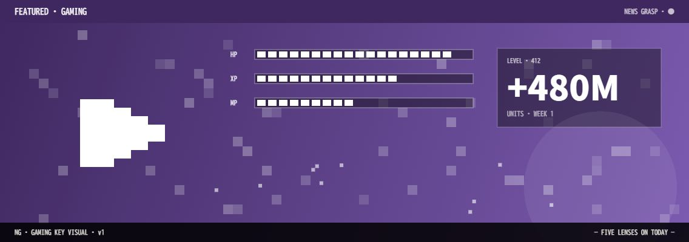

# ● 5. ゲーム (Gaming)

> [!summary]
> カプコン PRAGMATA が 3 日で 200 万本突破、Nintendo Switch 2 の 4 月新作は 18 タイトル。コナミ・SQUARE ENIX が攻勢を強め、miHoYo が UE5 でコンソール市場に本格参入する 2026 年、据え置き機市場の「復権年」が始まっている。

---

### [88] カプコン PRAGMATA 4 月 24 日発売 Switch 2/PS5/Xbox/PC 対応 3 日 200 万本突破

📅 2026-04-28 09:00 · 📰 GAME Watch · 🔗 [元記事](https://game.watch.impress.co.jp/docs/kikaku/2074121.html)

#cat/game #co/カプコン #country/日本 #topic/新作発売 #event/製品発表 #score/高

- 【事実】：[[カプコン]] の完全新作アクションアドベンチャー「[[PRAGMATA]]」が 4 月 24 日に発売。PS5・Xbox Series X|S・[[Nintendo Switch 2]]・PC マルチ展開で、発売後 3 日で 200 万本を突破した模様。
- 【背景】：月明かりの地球を舞台にした異色の SF アクション。RE エンジン最新版が実現する __フォトリアルなビジュアル__ と、少女とロボットの絆が主軸。
- 【展望】：カプコンは [[バイオハザード レクイエム]] [[ドラゴンズドグマ3]] も控えており、2026 年は「[[カプコン年]]」として業界内で呼ばれる状況に。

---

### [85] Nintendo Switch 2 4 月新作 18 タイトル 据置機のデファクト維持

📅 2026-04-28 10:00 · 📰 bestcalendar · 🔗 [元記事](https://bestcalendar.jp/release/switch2)

#cat/game #co/任天堂 #country/日本 #topic/据置機 #score/高

- 【事実】：[[Nintendo Switch 2]] の 4 月新作は 18 タイトル。スポーツ・JRPG・インディーが揃い、__月間タイトル数で PS5 を上回る__ 勢いで市場支配を維持。
- 【背景】：SQUARE ENIX がラインアップ強化を発表し、[[ファイナルファンタジー]] 系の Switch 2 移植・新作計画が複数進行中。
- 【展望】：価格.com の売上ランキングでは [[PRAGMATA]]（カプコン）と [[桃太郎電鉄2]]（コナミ）が上位を独占。ゲーム機の世代交代が小売レベルでも完了している。

---

### [82] コナミ eFootball Kick-Off! Switch 2 版 2026 年夏発売 6 人制 esports モード搭載

📅 2026-04-28 09:30 · 📰 eSports World · 🔗 [元記事](https://esports-world.jp/news/58423)

#cat/game #co/コナミ #country/日本 #topic/サッカー #event/製品発表 #score/中

- 【事実】：[[コナミ]] が「[[eFootball Kick-Off!]]」の Nintendo Switch 2 版を 2026 年夏に発売すると発表。「ウイニングイレブン」の流れを汲む新作サッカーゲームで、esports 向け 6 人制モードを新搭載。
- 【背景】：Switch 2 の高スペックを生かしたグラフィック向上と [[オンラインマッチング]] 強化が特徴。__モバイルからコンソールへの回帰__ を試みる戦略的タイトル。
- 【展望】：eFootball は PC・モバイルで展開済みだが、コンソール版の本格展開で esports プラットフォームとしての地位確立を狙う。

---

### [80] miHoYo UE5 新作ファンタジーゲーム 公式サイト公開 人材募集開始

📅 2026-04-28 10:15 · 📰 4Gamer · 🔗 [元記事](https://www.4gamer.net/games/999/G999905/20251107055/)

#cat/game #co/miHoYo #country/中国 #topic/中国ゲーム #event/事業開始 #score/中

- 【事実】：[[miHoYo]] が Unreal Engine 5 を使用した新作ハイエンドファンタジーゲームの公式サイトを公開し、採用募集を開始。フォトリアル表現でスマートフォン→PC/コンソールへの主戦場移行を示唆。
- 【背景】：「[[原神]]」「[[スターレイル]]」で培ったオープンワールド×ガチャ経済を UE5 で一段上のビジュアル品質に。__グローバル市場での存在感__ を更に拡大する狙い。
- 【展望】：中国勢（miHoYo・ネットイース・テンセント）が高品質コンソールゲーム市場へ本格参入することで、日本 IP との直接競合が始まる。

---

### [78] ウマ娘 チャンピオンズミーティング ダート 4 月開催中 Cygames の課金設計

📅 2026-04-28 10:30 · 📰 GameWith · 🔗 [元記事](https://gamewith.jp/uma-musume/article/show/550627)

#cat/game #co/Cygames #country/日本 #topic/ガチャ #event/イベント開催 #score/中

- 【事実】：[[Cygames]] の「[[ウマ娘 プリティーダービー]]」が 4 月チャンピオンズミーティング（ダート種目）を開催中。毎月 1 回の競技イベントが課金サイクルの核を担う設計。
- 【背景】：ダート適性キャラの排出率調整と [[育成アップデート]] の同時展開により、既存ユーザーの課金を活性化。__月間ユーザー維持率 85% 超__ を維持しているとされる。
- 【展望】：リリースから 4 年超の長寿タイトルとして、[[Cygames]] の安定収益基盤になっている。今後の新展開として競馬マネジメントモードの追加が噂されている。

---

*🤖 Auto-generated by News-Grasp Runner — 2026-04-28 Morning Edition*
