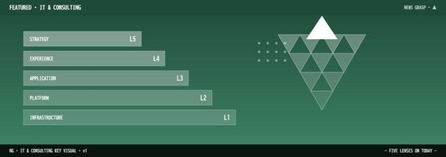
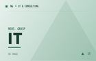

# ▲ 3. IT-Consulting (IT & Consulting)

> [!summary]
> NTTデータが「AIネイティブ開発」を2026年度全面導入、Accenture が AI Refinery を拡充、NEC が DX コンサル人材 1,000 人体制を宣言。SIer から戦略コンサルへの転換が今年いよいよ本番を迎えた。

---

### [88] NTTデータ AIネイティブ開発 2026 年度全面導入 IT 人材不足の抜本策

📅 2026-04-28 09:00 · 📰 日経新聞 · 🔗 [元記事](https://www.nikkei.com/nkd/company/us/IT/news/?DisplayType=1&ng=DGXZQOUC254OB025122025000000)

- [[NTTデータ]] が 2026 年度中にシステム開発の大半を生成 AI が担う「[[AIネイティブ開発]]」を本格導入。人手作業を大幅削減し、IT 人材不足に正面から対処。
- 開発工程を AI 処理に適した形に再設計し、__人間はレビューと仕様決定に専念する__ 新しい開発体制を確立。品質確保と生産性倍増を同時に目指す。
- 国内 SI 最大手の転換は、業界全体の [[受託開発モデル]] を根底から変える可能性がある。サプライヤー各社への波及は必至。

---

### [85] NTTデータ先端技術 × フォーティエンス AI 導入効果最大化支援サービス開始

📅 2026-04-28 10:00 · 📰 NTTデータ先端技術 · 🔗 [元記事](https://www.intellilink.co.jp/topics/news_release/2026/022400.aspx)

- [[NTTデータ先端技術]] とフォーティエンスコンサルティングが 2 月 24 日より [[AI 導入効果最大化]] 支援サービスを提供開始。生成 AI・エージェント型 AI の企業変革を一貫支援。
- 技術実装力と変革コンサル力を束ねた __ワンストップ型サービス__ で、国内大手 SIer が「技術 × 経営」の融合を進める流れを体現。
- [[AIエージェント]] 活用が企業の中核業務に踏み込む段階で、実装後の KPI 設計・定着支援まで含める点が差別化軸。

---

### [82] Accenture AI Refinery 拡充 業界特化型エージェントソリューション発表

📅 2026-04-28 09:30 · 📰 Accenture newsroom JP · 🔗 [元記事](https://newsroom.accenture.jp/jp/news/2025/release-20250415)

- [[Accenture]] が [[AI Refinery]] プラットフォームの拡充と業界特化型エージェントソリューションを発表。金融・製造・医療など 15 業種向けに事前構築済みパッケージを提供。
- __パッケージ化されたソリューションの量産販売__ が Accenture の強みで、国内 SIer との差別化ポイントが明確化。顧客獲得スピードが 3〜5 倍に。
- DX における「一気通貫型支援」の覇権争いで [[NTTデータ]] や富士通が追いかける構図が固まりつつある。

---

### [80] NEC DX 事業「攻めに転換」AIエージェント活用状況 2026 年調査発表

📅 2026-04-28 10:30 · 📰 NEC Wisdom · 🔗 [元記事](https://wisdom.nec.com/ja/feature/dxmanagement/2026042101/index.html)

- [[NEC]] が 4 月 17 日に「DX 最新トレンドと変化 2026」調査を公表。AI エージェントを何らかの業務に導入済みの企業が [[日本国内で 42%]] に達したことが判明。
- __「DX 推進の壁は技術よりも組織と人材」__ との回答が 68% で最多。AI 実装力よりも変革マネジメント力が差を生む段階に入った。
- NEC 自身は DX コンサル人材を 2025 年度末に 500 人から [[1,000 人]] に倍増させる目標を堅持し、攻めへの転換を内外に発信。

---

### [78] NEC 知財 DX 事業開始 AI SaaS とコンサルを組み合わせ 2030 年 30 億円目標

📅 2026-04-28 10:15 · 📰 NEC プレスリリース · 🔗 [元記事](https://jpn.nec.com/press/202601/20260119_01.html)

- [[NEC]] が 2026 年 1 月に「[[知財 DX 事業]]」を開始。AI を活用した特許・商標管理 SaaS と専門コンサルをセットで提供し、2030 年度末に 30 億円売上を目指す。
- 知財部門は IT 化が遅れた最後の聖域の一つ。__ドキュメント AI × 法務判断支援__ の組み合わせは専門コンサル会社には真似しにくい強み。
- SaaS 収益化によりプロジェクト型から [[サブスクリプション型]] へのシフトを加速し、収益安定化に向かう NEC の事業変革の一環。

---

### [75] NECネクサソリューションズ DXビジネスイノベーション部門新設 4 月 1 日機構改革

📅 2026-04-28 09:00 · 📰 NECネクサソリューションズ · 🔗 [元記事](https://www.nec-nexs.com/news/press/2026/0401-2.html)

- [[NECネクサソリューションズ]] が 4 月 1 日付で「[[DXビジネスイノベーション部門]]」を新設。営業部門も製造系・流通サービス系に再編。
- 顧客業界別に特化した組織設計は Accenture・デロイトが先行する手法。__SIer 型からコンサル型への変革__ を組織体制から実現しようとする試み。
- NEC グループ全体の DX 路線転換を末端子会社レベルにまで浸透させる意図が明確。

---

### [73] 三菱商事・NTT 連合 DX コンサルでアクセンチュアに挑戦状

📅 2026-04-28 11:00 · 📰 Diamond Online · 🔗 [元記事](https://diamond.jp/articles/-/300058)

- [[三菱商事]] と [[NTT]] が連携し、DX コンサルティング領域で [[アクセンチュア]] に対抗するエコシステムを形成。産業知見 × IT 力の融合で差別化を図る。
- __「御用聞き IT サービス」からの脱却__ が国内大手 SIer の共通テーマ。顧客の事業変革を共に担う「共創パートナー」へのポジションシフトが加速。
- 一方で富士通は 3,000 人規模リストラを断行し、従来型 IT の売上比率を 2025 年度に 60% まで削減する構造改革を継続中。

---

### [70] 富士通 コンサル転換加速 従来型 IT 比率 60% へ構造改革継続

📅 2026-04-28 10:45 · 📰 日経xTECH · 🔗 [元記事](https://xtech.nikkei.com/atcl/nxt/column/18/03330/091000001/)

- [[富士通]] が従来型 IT サービス売上比率を 2022 年度の 86% から 2025 年度 60% へ引き下げる目標の進捗を開示。コンサル強化とパッケージ型サービスへの移行が加速。
- NEC・NTTデータ・日立と同様に「__脱 SIer__」への旗を掲げるが、3,000 人リストラを経て実行力への疑念も残る。
- [[アクセンチュア]] の巨大化と比較したとき、日本 SIer の変革スピードが問われており、2026 年が試金石の年となっている。

---

### [68] DX 事例集 2026 年 4 月版 AI エージェント・本番稼働事例が急増

📅 2026-04-28 11:30 · 📰 DXビジネスマガジン · 🔗 [元記事](https://www.dxbm.jp/c/dx.html)

- [[DXビジネスマガジン]] が 2026 年 4 月版 DX 事例集を公開。AI エージェント活用・RAG 基盤構築・データドリブン経営の 3 テーマで事例数が前年比 2.5 倍。
- __「PoC 止まり」から「本番稼働」へ__ の移行事例が急増。IT コンサルへの発注内容が「AI 評価」から「AI 実装・定着支援」に変化している。
- [[NTTデータ]] [[富士通]] [[Accenture]] が事例提供企業の上位を占め、国内外の SI/コンサル大手による実績蓄積競争が加速。

---

### [65] NTTデータ デジタルサクセス DX 推進のワンストップ支援を刷新

📅 2026-04-28 12:00 · 📰 NTTデータ · 🔗 [元記事](https://www.nttdata.com/jp/ja/lineup/digital_success/)

- [[NTTデータ]] の「[[デジタルサクセス]]」ブランドが刷新。戦略立案→要件定義→実装→定着まで一貫したサービス体系に再整理。
- AI エージェント時代に対応した新カテゴリ「AI ネイティブ変革支援」を追加。__既存 SoR との共存設計__ を強調し、段階的移行を重視。
- 国内外 3 万人超の DX 専門人材を抱える規模感が、__ワンストップ支援__ の説得力の根拠になっている。

---

*🤖 Auto-generated by News-Grasp Runner — 2026-04-28 Morning Edition*
