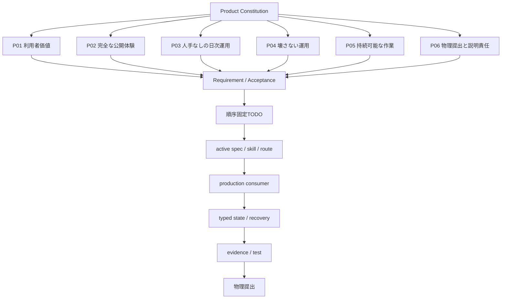
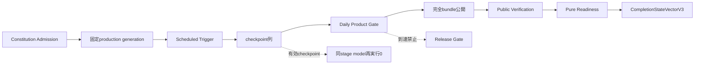
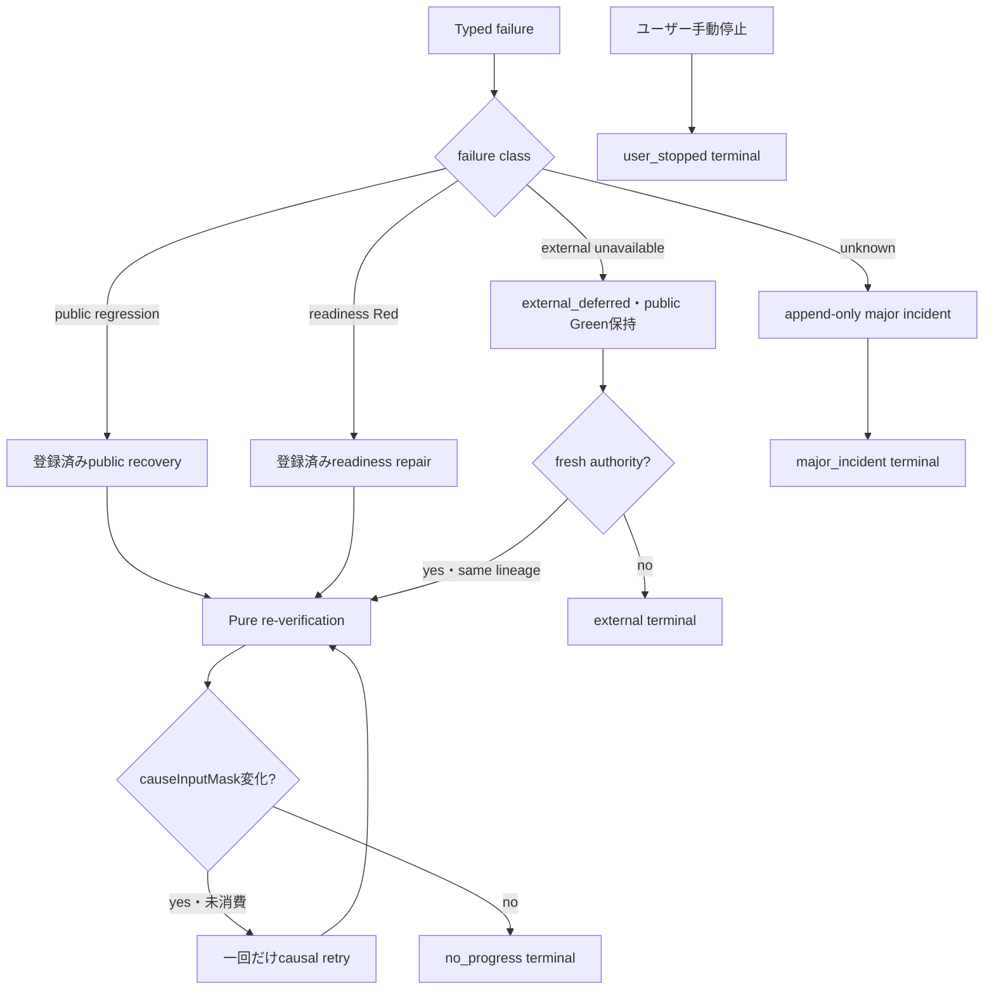
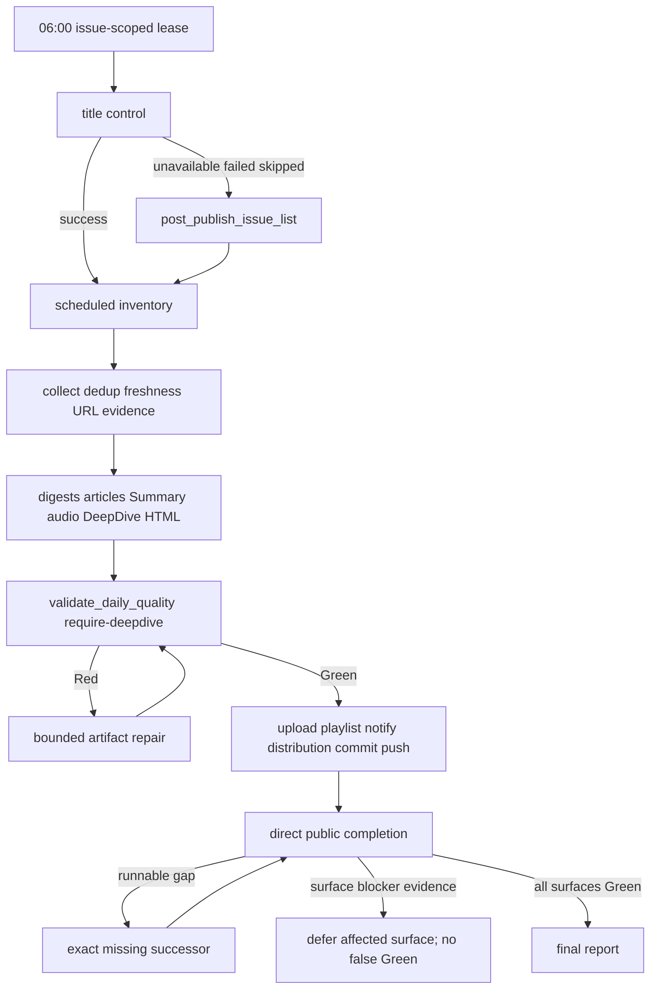

# Product Spec: News-Grasp

> **Status**: Constitution
> **Last Updated**: 2026-09-05
> **Owner**: News-Grasp Operator

## Product Constitution

News-Grasp は、繁忙なITコンサルタントが膨大なニュースを一つ一つ確認せず、重要論点を効率よく把握できる、分かりやすく実務示唆のあるニュース情報源である。

ミッションは、ITコンサルタントにとって最適・最良の情報を収集し、最適な粒度と効果的な伝達方法で届け、収集から執筆・編集・公開まで完全自立型ニュースサイトとして運営することにある。

この `docs/spec.md` は News-Grasp の上位プロダクト真実であり、日次バッチ、公開面、品質 gate、Podcast、通知、incident、runner state の改修判断はこの憲法に従う。

## 2026-08-30 Direct 06:00 Mainline Supersession

06:00 Codex automation の通常日次公開は `$news-grasp-direct-mainline` と空objectのMCP tool `news_grasp_daily.run_daily {}` だけをLunaの入口にする direct 本線である。MCP serverが固定Python 3.12で `tools.news_grasp_direct_runtime` を一回だけ起動し、六phaseの順序実行と状態更新を同じprocessで所有する。旧 runner、shell fallback、NoPublish、fallback publish、runner state、readiness、durable goal、audit/report、URL 200単独、publish-status単独、commit/push単独は、この route の public completion authority ではない。legacy runner/recovery 章と矛盾する場合、06:00 direct 本線については本節を優先する。

Windows Task Scheduler は廃止済みである。`News-Grasp Production`、`News-Grasp Bootstrap`、`News-Grasp Deadman`、`News-Grasp Runner`、`News-Grasp Title Materializer`を通常日次の起動、preflight、readiness、install、rollback、completion evidenceに使用しない。現行schedulerの唯一の正本はCodex automation `news-grasp-6-40`であり、template、installed TOML、Codex App DB、snapshotを`tools.sync_news_grasp_codex_automation --promote`で同一generationへ同期する。旧PowerShell/task launcher群は履歴・fixture専用で、直接実行は`NEWS_GRASP_WINDOWS_TASK_SCHEDULER_RETIRED`としてfail-closedにする。

direct 本線は `static_check`、`scoped_contract_unit`、`current_issue_integration`、`external_publication`、`consumer_public_verification`、`atomic_completion` の六phaseを順に一回だけ実行する。対象日確定、title control、scheduled inventory、ニュース収集、dedup/freshness/URL evidence、カテゴリ digest、reporter output、`data/articles.jsonl`、Summary、Daily audio、DeepDive、provenance/dialogue/rendered HTML、YouTube、playlist、notification、distribution、publish-status、commit/push、Pages semantic verificationの詳細eventは失わないが、利用者向け進行と完了判定は六phaseへ投影する。同じacceptance predicateを別stageで再評価せず、historical corpusと全件品質監査はRelease gateだけが所有する。

`NEWS_GRASP_DIRECT_PUBLIC_VERIFICATION_V1` は consumer-owned public verifier が実成果物と実公開面を検査して作る projection だけを authority にする。caller作成の completion JSON、fixture、文字列 marker、URL 200単独、publish-status単独は Green に読み替えない。content-derived identity、SHA、digest、hash、fingerprint、Merkle は 06:00 direct 本線の active 制御 authority に使わない。記事工程名としてのカテゴリ digest はこの禁止に含めない。

title は最初の実作業で `YY/MM/DD News-Grasp 臨時本線日次バッチ 6:00 記事作成・公開` を試行し、`title_status` を `updated / already_ok / unavailable / failed / skipped` のいずれかで記録する。`updated/already_ok` の場合だけ実 title の exact pattern 一致を必須にし、失敗 status は `post_publish_issue_list` に残して公開 critical path を継続する。

### 2026-09-05 Same-run Recovery Amendment

06:00 direct 本線の制御identityは `automation_id + issue_date + run_intent` と開始時のimmutable start sealである。start sealはself hash、run行の不変項目、`O_EXCL`で独立保存したsidecar bytesへ束縛し、runtime generationはDaily実行ファイル群のbytes manifest hashとする。開始後にtemplate、installed automation、App DB、snapshot、`origin/main`、caller観測のIDまたはSHAが変化しても、開始済みrunを停止・rebind・新generation化しない。現runはstart sealのsource baseline、remote base、manifest reservationで継続し、差分は `nextRunReadinessStatus=Red` のdebtとして次回promotionへ分離する。runtime bytesまたはcanonical許可side effect集合の差異はdebtへ格下げしない。

競合するlive writerが存在せずleaseが失効した場合は、保存済みDaily operation receiptの連続列をcanonical authorityとし、同じrun IDとdaily lineageへCAS takeoverする。新しいwriter leaseとfencing tokenを発行し、未完了claimだけを`recoverable`へ移し、最初の未完了operationを唯一のexact successorとする。Green receipt、Green artifact、provider receiptを再実行・再送してはならない。安全なsuccessorが存在する不一致を`blocked` terminalへ変換しない。

runtime改ざん、state DB破損、競合live writer、許可外副作用だけは推測継続せず`failed_integrity`とする。caller supplied run ID、manifest ID、SHA、pathはactive制御authorityにせず、通常Daily入口は空入力の単一MCP tool `news_grasp_daily.run_daily {}`だけとする。

### Artifact Repair Contract

日次成果物の依存正本は `tools.news_grasp_repair_registry.build_daily_artifact_dag` とし、candidate snapshot、カテゴリ別reporter、records/search audit/digest、editor、articles slice、Summary、Daily audio script/audio/projection/video、DeepDive model/article/dialogue/HTML/audio/projection/video、site HTML、distribution manifest、publish status、Git/Pages、YouTube、playlist、notification、public verificationを一つのDAGへ固定する。品質Redまたは欠落の修復単位はfile全体やrun全体ではなくartifact IDである。

`NEWS_GRASP_REPAIR_PLAN_V1` は `stage|artifactId|predicateId|reasonCode|inputHash` のfailure signatureをrootとし、そのartifactとdirty downstreamだけを `repair_model`、`rebuild_deterministic`、`reconcile_external` のいずれかへ割り当てる。入力hashとoracleが一致するGreen checkpointは `reuse` とし、再収集、再生成、再送しない。決定論的派生だけがRedの場合のmodel callは0、provider receiptが存在する外部副作用は再送ではなくreconcileだけを許可する。plan、artifact checkpoint、model call reservationはworktree内fileでなくWindows Known Folderの正規runtime SQLiteへ保存し、actual run ID、issue date、writer lease、fencing tokenへ各transactionを束縛する。reuse時も正規validatorと実artifact hashを再実行し、不一致時は無効bytesと`causeInputMask`を保持して同じplanの対象artifactだけをdirtyへ戻す。修復modelの出力はfailureから導いたJSON Pointer集合だけを変更でき、同一artifact内の正常fieldを含む集合外の差分は`REPAIR_UNSCOPED_MUTATION`で拒否する。reporter shardの一部だけがRedの場合は、同一transactionでGreen categoryのcheckpointとRed categoryのfailureを保存し、次の呼出しはRed categoryだけを対象にする。model callの予約とvalidated checkpoint確定は同一transactionであり、operation heartbeatが生きる間はtakeoverを許可せず、旧fenceはfile materialization前後にも拒否する。unknown artifact、循環、plan hash不一致、DB欠落を伴う既存start sealはfail-closedとする。

### Luna Single-Tool And Model Budget Contract

通常日次のLunaはMCP tool `news_grasp_daily.run_daily`を空objectで一回だけ呼ぶ。tool以外のshell、個別operation、poll、再呼出し、run ID・SHA・manifest ID指定を認めない。toolはTOMLのcwdやLLM入力を実行root authorityにせず、automation promotionが固定した`NEWS_GRASP_DAILY_BROKER_PROMOTION_V1`のrepo root、commit ancestor、source generation、必須file hash、server self bytes、reparse-free pathを全て確認してから固定Python 3.12でdirect runtimeを一回起動する。promotionは非terminal runが0のときだけ固定root `C:\ngstage\News-Grasp-runtime`へ行い、broker receipt、local marketplace root、installed/enabled plugin source、plugin 3ファイルのhash、実serverの`tools/list=[run_daily]`を同一bytesへ束縛してからautomationを切り替える。stdinとchild stdout/stderrはbounded streamとし、stderr本文を返さない。空object以外、receipt/source/server drift、root ambiguityは外部処理前にtyped Redとする。

通常5カテゴリの初回model callはreporter shard 3、editor 1、DeepDive 1の合計5を上限とする。修復用は同一issue dateの共有atomic ledgerで最大4、全体最大9とし、run ID、worktree、sessionを変えても予算をリセットしない。各model artifactは入力hash付きGreen checkpointを直後にatomic保存する。品質Red時はfailure signature、無効payload、`causeInputMask`をpromptへ渡し、Red artifactだけを修正してGreen reporter、candidate、editorおよび決定論的派生を再利用する。75分以降は新規candidate収集、model生成、高コスト派生成果物を各entry gateで拒否する。idempotency keyを予約済みで未送信のpublic-critical operationは初回送信を継続し、startedまたはACK不明のoperationは再送せずread-only reconcileへ進む。90分はSLO debtであってprocess hard timeoutではない。予算外のmodel再生成とprovider再送は拒否するが、same-run resume、決定論的downstream、read-only provider reconcile、consumer verification、atomic finalizationは継続する。

<!-- NEWS_GRASP_CONSTITUTION_V1_START -->
## 憲法の機械正本（NEWS_GRASP_CONSTITUTION_V1）

この節はNews-Graspの全仕様・skill・TODO・production consumer・状態・復旧・証拠・testが実現すべき世界を定義する。ここへ結線できないものはactive経路へ追加しない。意味変更authorityは`user_only`であり、agent・model・reviewer・handlerは新原則を自己追加できない。

```json
{"schemaVersion":"NEWS_GRASP_CONSTITUTION_V1","constitutionVersion":"2026-08-12","pillarCount":6,"clauseCount":14,"amendmentAuthority":"user_only","primaryUser":"ITコンサルタントとしてNews-Graspを利用するユーザー","naturalRunEvidenceAllowed":false,"sharedGlobalHarnessMutationAllowed":false}
```

### 6 pillarsと利用者価値

| Pillar ID | 世界観 | 利用者が得る状態 |
|---|---|---|
| NGP-P01 | 利用者価値 | 意思決定・提案・設計・顧客対話に使える |
| NGP-P02 | 完全な公開体験 | 記事、Web、音声、Podcast、通知が一体で届く |
| NGP-P03 | 人手なしの日次運用 | 生成から次回準備まで自然実行だけで閉じる |
| NGP-P04 | 壊さない・信頼できる運用 | 公開Greenと正しいruntime authorityを守る |
| NGP-P05 | 持続可能な作業 | 人間負担・手戻り・総期待資源を抑える |
| NGP-P06 | 物理提出と説明責任 | 利用可能状態と監査証拠を残す |

### 14 constitution clauses

| Clause ID | Pillar | 不変条件 |
|---|---|---|
| NGC-C01 | NGP-P01 | 利用者の業務価値へ接続する |
| NGC-C02 | NGP-P01 | 編集・出典・鮮度・関連性品質を守る |
| NGC-C03 | NGP-P02 | 必須公開bundleの部分完了を認めない |
| NGC-C04 | NGP-P03 | 日次全工程を人手なしで閉じる |
| NGC-C05 | NGP-P03 | repair-firstで同日公開成果を守る |
| NGC-C06 | NGP-P04 | 危険・secret・破壊・public regressionをfail-closedにする |
| NGC-C07 | NGP-P04 | scheduled/recovery/public/readiness/audit/externalを分離する |
| NGC-C08 | NGP-P05 | checkpointと因果retryで再生成を防ぐ |
| NGC-C09 | NGP-P04 | immutable generationとsingle writerを守る |
| NGC-C10 | NGP-P04 | 登録済み復旧だけを実行する |
| NGC-C11 | NGP-P05 | noFocusTheft・noAutoOpen・noMonitoring・即時停止を守る |
| NGC-C12 | NGP-P05 | Sol/Luna/local toolをentropyに応じて配置する |
| NGC-C13 | NGP-P06 | commit/push/install/runtime/task/rollbackを閉じる |
| NGC-C14 | NGP-P06 | 全active仕様を憲法へ結び、憲法改変をユーザーだけに限定する |

### 憲法から物理提出までの結線

trace正本は `clause→pillar→userOutcome→requirement→acceptance→TODO→activeObject→consumer→state→recovery→evidence→test→physicalDelivery` の全edgeを保持する。図は `NEWS_GRASP_CONSTITUTION_TRACE_V1` から生成されたprojectionだけを証拠とする。







### 憲法不一致物の扱い

`NEWS_GRASP_ACTIVE_OBJECT_CATALOG_V1`はbinding JSONを情報源にせず、Git・AST・実trigger・pytest collectionからactive objectを独立列挙する。traceが無い物は `disabled_pending_dependency_scan`、live参照ありなら `superseded_history`、参照なしなら `delete_ready` とする。

### 完了の意味

Product completionは、生成、checkpoint、登録済み復旧、必須bundle公開、public verification、次回readiness、audit、external status、rollback、証拠、物理提出を別stateで取得した場合だけ成立する。自然scheduled run、待機、ユーザー目視はAcceptanceでも完了証拠でもない。

<!-- NEWS_GRASP_CONSTITUTION_V1_END -->

## 2026-08-27 Public Recovery Closeout Commitment

本節は2026-08-27のNews-Grasp復旧で43分の遅延を生んだproduct/runtime境界を、通常daily runner、`ScheduledRecoveryFull`、`ResumeFromStage`、post-public finalizerの実運用経路で恒久的に閉じるUser Answer Provenanceである。ProjectFolders共通のestimate、reflection、EvidenceHold、06:40 scheduler制御は参照のみとし、News-Grasp側へ同等gateを複製しない。

| Requirement | 不変条件 | Green authority |
|---|---|---|
| `NG-RC-01` | eligibleなprimary transport failureだけに、同一URLのWindows system transport fallbackを一回だけ許可する | final URL、status、本文SHA256、transport、attempt countを持つV2 provenance |
| `NG-RC-02` | claim-source、V2 provenance、dialogue、rendered publicを全runner route共通のissue materializerで確定する | `DEEPDIVE_ISSUE_BUNDLE_V1` と `audit-issue --require-rendered-public` |
| `NG-RC-03` | recovery worktree、active generation、production runtimeのcritical-file SHAが一致するまでchild processを起動しない | per-file SHA、set hash、HEAD、spawn count 0/1を持つfreshness receipt |
| `NG-RC-04` | public Green後のfinalizer argvはexecution receiptのbranch、resume stage、全root、Python、runner stateからだけ導出する | receipt hashとexact argv hash、runner `publish_complete` |
| `NG-RC-05` | known receipt driftはpublic artifactを変えず一回で一括検出・再封印・execution/finalization再検証する | pre/post receipt hash、ledger遷移、public tree hash不変 |
| `NG-RC-06` | public Green後はexact-args replay、receipt reseal、completion guard、public surface verify、final reportだけを許可する | exact operation ledger、未知operationの`post_public_closeout_blocker` |

`scheduledAttemptStatus`、`recoveryAttemptStatus`、`publicCompletionStatus`、`runnerStatus`、`nextRunReadinessStatus`は交換不能な別fieldである。scheduled failureは復旧成功で上書きせず、`publicCompletionStatus=Green`はcloseoutまたはreadiness Redで後退させない。

同一日付・同一run intentの結合試験はactual Windows system transportとactual typed finalizer-only PowerShell branchを通す。ただしfull E2E、external model fan-out、fallback publish、NoPublish completion、public regeneration、URL 200単独Greenは禁止する。public Green後の再生成、広域探索、原因調査、report polishもcloseout operationではない。

## 2026-08-11 運用再設計コミットメント

本節は、公開成果物を保持したまま日次運用を自走させるためのNews-Grasp専用契約である。ProjectFolders共通ハーネス、共有model broker、routing、hook、review基盤、他repo、別sessionのworktree・transactionは変更対象外であり、競合時は競合側の確定commitを正本として本作業を従にする。

### 成功状態

通常scheduled productionは、固定production generation上で `生成 → checkpoint確定 → 登録済み復旧 → 公開確認 → 次回readiness収束` を人手なしで閉じる。自然scheduled runの待機、翌朝の観測、ユーザー目視は完了条件に含めない。次のstateは一値へ潰さず交換不能な別fieldとして保存する。

| state | 意味 | 後退条件 |
|---|---|---|
| `scheduledAttemptStatus` | 当日scheduled試行の結果 | 同一lineageのfailure/event追記のみ |
| `recoveryAttemptStatus` | 登録済み復旧の結果 | retry ledgerのcause変化のみ |
| `publicCompletionStatus` | 必須bundleと公開面の検証結果 | verified public regressionのみ |
| `nextRunReadinessStatus` | 次回runnerの純粋readiness | probe結果をrepairへ分岐 |
| `auditObservationStatus` | 最新観測と履歴の状態 | append-only observation |
| `operationalStatus` | public/readinessを合わせた総合状態 | 両方GreenのときだけGreen |

readiness Red、verification unavailable、wrapper異常だけで `publicCompletionStatus=Green` をRedへ戻してはならない。DeepDive記事・対談・音声を通常公開bundleに含め、有効なcheckpointがあるstageはwrapper rc126/timeout/hangでもmodelを再実行せず、決定論的な後続工程だけを継続する。

### Product-local write admission

product sourceのmutationは `config/news_grasp_product_write_allowlist_v1.json` と `tools/news_grasp_change_control.py` の単一入口に限定する。Lunaはtargetを直接編集せず、隔離change packetとmetadataだけを生成する。consumerはmutation直前にremote HEAD、全worktree、target hash、競合owner、reparse/symlink/hardlink、absolute/UNC/ADS/`..`/case alias、baseline driftを再検証する。競合ownerが存在する場合はexit 73、path/reparse/baseline driftはexit 74で拒否する。named mutex `Global\\NewsGraspProductChangeV1` とtransaction journalで部分適用を防ぎ、成功receiptのないpacket再利用を拒否する。

### Immutable production generation

`ProductionGenerationManifestV2` はsource commit/origin/common-dir、tracked source manifest、runtime root/file hash、config hash、Codex automation template/installed/App DB/snapshot hash、direct launcher hash、previous generationを封印する。Codex automationのcwdはremote mainと一致するclean production worktreeだけを指し、任意repo/worktree overrideを持たない。active pointerはpromotion完了後に一度だけatomic replaceし、generationはimmutableとする。rollbackは旧manifestとbytes parityを再検証した後だけ行う。

### Pure readiness と登録済み復旧

`probe-readiness` はread-onlyでfile/process/task/network mutationを行わない。`repair-readiness` はtyped authorityと登録済みhandlerを必須とし、repair側の自己申告Greenを認めない。repair後は同じroot・generationへboundしたpure probeを再実行する。unknown reasonは唯一のappend-only `major incident`へ閉じ、shell/model/source/rule/test writeへ到達させない。

### Checkpoint・lineage・causal retry

`ArtifactCheckpointV1` はissue date、daily operation lineage、stage、input/output hash、schema、oracle、producer route、次工程を保持する。cause fingerprintはartifact/failure class別のcauseInputMaskだけから生成し、run/session/path/時刻を含めない。retry ledger keyは `issueDate | dailyOperationLineageId | artifactKey | producerRouteId | failureClass` とし、同一fingerprintはretry 0、mask内の因果hash変化時だけatomic one-shot retryを許可する。

### Gate分離と物理提出

Daily gateは当日製品oracle・必須bundle・public surface・distribution・notification・pure readinessだけを評価する。pytest全回帰、Playwright、historical、crash/replay/drift、final NoPublish E2EはRelease gateへ移し、scheduled/recovery call graphから到達不能にする。全下位証拠がGreenになった後だけsafe commit、fast-forward push、remote HEAD、Codex automation promotion、template/installed/App DB/snapshot parity、rollback receipt、隔離NoPublish E2E一回を順に閉じる。NoPublish E2Eのpublish/push/upload/notification副作用は0とする。

### 2026-09-03 Daily Public 45-minute Contract

`NG-DAILY-45M-20260902` は、記事品質を削らずに重複判定とRelease-only検証を日次critical pathから除外する。Lunaが起動できるentryは空objectのMCP tool `news_grasp_daily.run_daily {}` 一つだけであり、MCP serverが固定Python 3.12で起動する同一runtime process memoryのwriter leaseにより `static_check` → `scoped_contract_unit` → `current_issue_integration` → `external_publication` → `consumer_public_verification` → `atomic_completion` を順に一回ずつ実行する。個別operation CLI、raw/full pytest、historical corpus、Playwright全件、crash/replay/drift、final NoPublish E2E、Release gate、raw Python、未登録routeはspawn前にfail-closedにし、writer/fencing capabilityをstdout・環境変数・receiptへ投影しない。`protectedRelease`の通常Daily再実行はstate作成前に拒否し、production runtime/Release stateはWindows Known Folderへ固定する。Release ledgerはMAC付きhash-chainとprocess横断lockを用いる。committed sourceではGreen event・promotion receipt・発行eventを同一排他区間でexactly onceに束縛し、staged candidateではGreen eventを先に封印したうえで、exact tree/direct parent commit確認後の別transactionが同じrelease eventへpromotionをexactly onceで付加する。

本番反映は`tools.sync_news_grasp_codex_automation --promote --write-snapshot --write-skill --write-app-db`だけが所有し、Codex automation template、installed TOML、installed skill、Codex App DB、project/shadow snapshotをbackup・CAS rollback receipt付きで同期する。Windows Task Scheduler installer、bootstrap、deadman、task launcherは通常日次・recovery・readinessから到達不能とする。Codex automationは空objectのMCP tool `news_grasp_daily.run_daily {}` を一回だけ呼び、登録済みMCP serverだけがremote mainと一致するclean production worktreeの固定Pythonから `tools.news_grasp_direct_runtime` を一回起動する。Release-only NoPublishは実P08 isolation consumerでcleanroom差分を検証し、`tools/news_grasp_release_nopublish.py` を隔離worktree・隔離stateで起動して、外部adapter呼出し0と保護済み2026-09-02の再生成・再配信0を機械的に保証する。

各acceptance predicateは `generation_id + predicate_id` につき一つのownerが一つのcanonical sourceから一度だけ判定する。Summaryの正本はfrontmatter付きMarkdown、DeepDive direct監査はcurrent issueだけ、HTMLはproducerの派生物である。Release gateは全pytest nodeを排他的partitionへ分類し、各nodeを一回だけ実行したreceiptの和集合でfull suiteを証明する。

Release gateのcollection、partition、causal repair、finalize、Daily promotionは、同じclean Git repo root・HEAD・treeをreceiptへ固定し、各process前後とpromotion直前に再観測する。source drift、dirty worktree、別rootはfail-closedとし、古いRelease Greenを別sourceへ付け替えない。causal repairは専用authority writerが`repair_started`と`repair_completed`を一対一で記録し、previous receipt、cause hash、exact failed set、source identityが一本の鎖にならないstartless、fork、orphan、inflight receiptを完了根拠にしない。

commit前のRelease検証は、全意図差分がstage済みでunstaged/untracked差分がないGit index treeをcandidate sourceとして固定する。baseline HEADとcandidate treeを一回だけ全nodeで検証し、commit後のclean HEADが同じtreeを持ち、baseline HEADを直接親に持つ場合だけDaily promotionを発行する。これによりsafe-commitのcommit前Greenを維持しつつ、同じfull suiteの二重実行と未検証commitへの差替えを拒否する。repair authorityは実pytest processを起動するclosure外へstarted/completed writerを公開しない。`release_completed`後・promotion前の停止は同じrelease eventへattachし、nodeを再実行せず欠落promotionだけをexactly once回復する。

Release CLIはmachine-readable UTF-8 JSON一行とprocess exitを同じ結果へ束縛する。`promote`はauthoritative receiptの`status=trusted`だけをCLIの`ok=true`へ投影し、state適用済みの成功をexit 1へ誤変換しない。parse/transport failure時は適用済みreceiptをidempotency identityで照会し、promotionや外部副作用を再適用しない。

preflightはissue date、run intent、actual run ID、writer fencing token、scheduler trigger、source baseline、runtime generation、remote base SHA、許可外部副作用をstart sealへ固定する。外部公開直前にrelease commit SHA、exact write set、file hash、manifest ID、bundle ID、external operation IDをpublish sealへ固定する。外部公開開始後のsource、manifest、write set driftは同runへrebindせず `superseded_after_external_start` として新generationを要求する。

state/notification ledgerはrun作成前にV2へmigrationする。single-flight identityは `automation_id + issue_date + run_intent` であり、cwdを含めない。child resultはUTF-8一行JSON、canonical snake_case schema、input hashをmutation前に検証し、stateとapplied receiptを同一transactionでcommitする。retryはidempotency keyのreceipt照会だけをauthorityにする。

external outboxの`reserved`→`started` CASと`external_wait`開始eventは同一SQLite transactionでcommitし、timing永続化失敗時はproviderを呼ばず`reserved`を維持する。YouTube finalizeはprivacy、kind playlist、DeepDive primary playlistをfresh provider観測済みsubstepとして`uploadHistoryV2`へ個別確定し、crash後は不足substepだけを再開する。notificationはrecipient-events ledgerの`sent`/`gone`を再送せず、未開始recipientだけを続行する。provider call開始の可能性がある`reserved` recipientは`unknown_delivery`として再送しない。

scheduler triggerをT0としてinternal processing、queue、external wait、retry、handoff、user wait、unmeasuredを永続化する。completion時のelapsedは固定し、inspect時に増加させない。45分で `method_change`、75分で `scope_reduce`、90分超で `deadline_revision` を一度だけdispatchするが、公開必須inventoryやconsumer verifierを削らない。

atomic completionは、同一issue date・run intent・actual run ID・bundle ID・manifest ID・release/remote/Pages SHAに束縛されたfresh consumer-owned public verifierだけが発行できる。7カテゴリuniverse、当日scheduledカテゴリ、Summary/DeepDive MarkdownとHTML、日次/DeepDive音声、YouTube、playlist、notification immutable sender ledger、distribution、publish-status、Home、Pagesの論理積を要求する。provider delivery ACKを取得できない場合は `unknown_unobtainable` を維持し、成功・失敗・再送要求のいずれにも変換しない。

automation promptはtemplate、installed TOML、App DB、全snapshotでexact一致し、指定文言が最優先事項・完了条件・禁止条件に各一回存在する。runtime startはdriftを自動修復せずRedにし、backup/rollback receiptを伴う明示promotionだけが更新できる。

### Model役割と境界

要件・設計・security判断はSol Max、固定された機械編集と限定fixtureはLuna Max（reasoning effort max）、hash/JSON/test/parityはlocal deterministic toolとする。本節の実装ではLuna packetに `unresolvedDecisionIds=[]`、exact write set、Red oracle、command、causal retry、rollback、`return_to_sol_before_execution` を必須化する。共有global変更、public semantics変更、未登録failure class、write set拡張は実行せず上流設計へ戻す。

| Area | Requirement |
|---|---|
| Primary reader | 繁忙なITコンサルタント。一般ニュース読者ではなく、業務判断に使える粒度と示唆を必要とする読者。 |
| Core value | ニュース量を圧縮しつつ、重要論点、背景、影響、次に見るべき観点を短時間で掴めること。 |
| Delivery model | Web / Audio / YouTube Podcast / playlist / notification を整合した単一の公開体験として届けること。 |
| Operating model | 人手の常時介入を前提にせず、収集、執筆、編集、品質修復、公開、検証まで自走すること。 |

## Principle 1: 直せるものは直して完走

品質 gate は「問題を見つけたので止める」ためだけに存在しない。既知の品質問題は、止める前に repair、quarantine+refill、reporter retry、re-verify のいずれかへ分類し、修復可能な範囲では直せるものは直して完走する。

ただし、完走は壊れた公開を押し通すことではない。修復予算を超えた失敗、未知分類、外部依存、配信不能、security risk は typed fatal として止め、状態、exit code、incident evidence を残す。

## Definition of Done

### Same-day public recovery priority

`same_day_public_recovery_first` は News-Grasp の作業順序に関する憲法である。対象日の公開面が本 Definition of Done を満たさない間、最優先の action は `scheduled_recovery` とし、その開始に不可欠な `minimal_recovery_unblocker` だけを先行できる。復旧不能なら黙って deferred にせず `escalate_major_incident` とする。

公開 Green 前の `incident_report_polish`、`root_cause_hardening`、無関係な cleanup を禁止する。公開 Green 直後は `runner_finalization_only` とし、`manifest_reverification`、`typed_runner_finalizer`、`completion_guard` の3操作だけを許可する。finalizerはcanonical verifierが再生成したmanifestのSHA、Global brokerがproduction ledgerから再検証したrecovery authority witness、scheduled failure receipt、artifact/ops/runtime/live root、実producer lineage、T0/Tgreen、先行execution receiptのpath/hash/nonceを `NEWS_GRASP_RECOVERY_FINALIZATION_RECEIPT_V1` に束縛し、state更新前に再検証する。receipt本文の自己SHAは改ざん検知に限定しauthorityとは扱わない。execution/finalization/repair receiptはlive binのpath非依存SQLite ledgerでsemantic identityを一度だけ消費し、別名copyと別nonce再発行を拒否する。crash時は同一receiptだけをpending journalから再開し、operation/state反映後はappliedへ閉じる。4-root preflightのrunner stateは実行intentへ束縛する。`ScheduledProduction`、`ScheduledRecoveryFull`、`ScheduledEquivalentNoPublish` はlive binのcanonical state固定で、caller指定による別pathを拒否する。`StartupCanary` だけが明示した隔離stateを使い、productionの完了履歴を現在のroot bindingへ再解釈しない。readiness canaryはstate/log/cwdをartifact rootに保つ一方、bootstrapへclean ops rootを`RepoDir`と`EvidenceRepoDir`で渡し、production runtimeの正本接続をartifact worktreeへ逆流させない。production/recovery stateのroot drift検査にstatus文字列だけの例外を設けない。production recoveryはlive binの `NEWS_GRASP_RECOVERY_RUNTIME_BINDING_V1` を入口にするが、bindingの自己申告を信頼せず、Pythonの固定canonical path・SHA・Valid Authenticode・PSF signer、ops HEADとtrusted remote mainの一致、tracked/untracked/ignoredのclean、validator依存closureのhashを毎回再検証する。critical Python entrypointは検証済み絶対pathを`-I -S -B`で直接起動し、`sitecustomize.py`、`usercustomize.py`、ambient `PYTHONPATH`、venv startup hookを実行前に遮断する。caller指定interpreter、ops override、ambient rootはexact一致以外を拒否する。completion guardは信頼済みcallerから受けたrootとstate pathを期待値として同receiptとstateのTdoneを再検証し、任意clock/root/output上書きを受理しない。この critical path が完了してから障害報告と恒久修正を `root_cause_after_public_green` として開始する。`tools.audit_recovery_control` の sealed decision、6:40 automation、runner/recovery state はこの同じ順序述語を使う。

Global HighCost capabilityとのproduct境界は `NEWS_GRASP_HIGH_COST_BINDING_V1` とする。Codex automation promotionはGlobalの `HIGH_COST_CAPABILITY_DESCRIPTOR_V1` と共通 `high_cost_capability_adapter.py probe/resolve` がGreenであることをlive mutation前に確認し、descriptor path/hash/generation、adapter path/hash、workspace rootをproduct-local receiptへ束縛する。authority、budget、goal、audit terminalは複製しない。Codex automation prompt、direct launcher、model wrapper、direct runtimeは同じbinding identityを明示伝播して各境界で再検証する。productionのCodex automation Daily/recovery intentは旧 `HighCostWorkspaceRoot` / `HighCostBudgetToolPath` と全ambient workspace rootを拒否する。隔離testも正規schemaの一時bindingを生成して同じconsumerへ注入し、test専用root fallbackをproduction moduleへ持ち込まない。descriptor、adapter、binding fileのいずれかが変化した場合は生成・model・publish前に `HIGH_COST_IDENTITY_DRIFT` で停止し、workspace binding欠落、broker不在、operation admission欠落を別reasonとして保持する。

Codex automation `news-grasp-6-40` は`status=ACTIVE`、毎日06:00 JST、local project、固定Luna/max、clean production cwdを持つ。prompt、installed TOML、Codex App DB、snapshotのexact parityと、direct launcherの固定Python 3.12・UTF-8 JSON・noFocusTheft/noAutoOpen/noUserMonitoringを開始前に検証する。Windows Task Scheduler、runner、bootstrap、deadman、title materializerの存在・状態・Action・triggerは通常日次のreadinessまたはcompletion predicateに含めない。

通常日次バッチの OK marker は、次の成果物と公開面がすべて verified になった後にだけ書く。

| Area | Requirement |
|---|---|
| Digest | 当日の対象カテゴリ digest が揃い、Summary が当日の論点を統合している。 |
| DeepDive | DeepDive md と DeepDive HTML が生成され、公開ページから参照できる。 |
| Web | 日付 docs、カテゴリページ、summary ページ、GitHub Pages 反映、公開 URL sentinel が確認済み。 |
| Audio | TTS public audio が生成され、公開ページから再生可能な状態になっている。 |
| Podcast | YouTube Podcast が public 化され、playlist 反映まで verified になっている。 |
| Notification | 通知送信が完了するか、送信不能理由が typed status として残っている。 |
| State | runner state、distribution state、OK marker が同じ日付と同じ run intent を指している。 |

### News-Grasp 通常公開 inventory 必須

`news-grasp-publish-inventory-required`: News-Grasp の通常公開・本日分公開・途中再開を完了報告する場合、7カテゴリ digest、Summary、DeepDive md、DeepDive HTML、日付 docs、`docs/publish-status.json` の `published_ok`、公開 URL sentinel、`validate_daily_quality --require-deepdive` の証跡を必ず列挙する。公開に必要なコンテンツが 1 つでも欠ける場合は、正当な欠落理由と検証 gate を明記し、完了と言わない。

## Editorial Quality Bar

News-Grasp の記事は、ITコンサルタントが業務の隙間で読むことを前提にする。単なるニュース羅列ではなく、論点、背景、示唆、関係性、次の確認観点を明確にする。

必須品質は次の通り。

| Area | Requirement |
|---|---|
| Accuracy | 事実、日付、企業名、URL、引用関係が検証可能である。 |
| Relevance | ITコンサルタントの提案、調査、設計、顧客対話、意思決定に関係する論点を優先する。 |
| Granularity | 忙しい読者が短時間で要点を掴める粒度に圧縮し、必要な深掘り先も残す。 |
| Insight | 「何が起きたか」だけでなく「なぜ重要か」「どこに影響するか」を示す。 |
| Readability | 見出し、要約、カテゴリ、DeepDive、音声の伝達方法が相互に補完する。 |
| Summary headline | 2026-08-03号以降は `hero_headline` を正本とし、当日の単一の主役ニュースを主体・出来事・動作または結果まで12〜42字で要約する。複数の独立ニュースを `と` / `・` で接合したカテゴリ横断標語と抽象的な二句対比を禁止する。`hero_left` / `hero_right` は過去号の表示互換に限る。 |
| Source health | 出典 URL は記事単位の canonical URL を優先し、媒体トップやカテゴリトップで代替しない。 |

## System Integrity

News-Grasp は、部分成果の集合ではなく、読者が見る公開体験として成立して初めて成功とする。

Web / Audio / YouTube Podcast / playlist / notification は別々の付録ではない。どれか一つを WARN に落として OK にする場合は、この憲法の Definition of Done を満たさない理由を typed status と incident evidence に残す。

runner、watcher、repair、publish verification、podcast verification、distribution state は、同じ日付、同じ成果物、同じ完了条件を見なければならない。局所最適な修正で、別工程の正本や公開面との整合を壊してはならない。

### Weekly Failure Source-of-Truth and Runner Terminal Semantics

週次・日次 failure の分類では、validator が生成した structured issue_code を唯一の分類正本とする。structured unknown を message prose から再分類してはならない。matrix は issue artifact と handler scope を実行前に照合し、registry は handler existence、scope mismatch、not-applicable、output scope violation を別 status として返す。

runner は固定 attempt 回数を terminal predicate にしてはならない。終了判定は deadline と typed repair ledger に基づき、同一 issue の ordered ledger、選択 artifact、handler status、same-gate reverify を残す。GitHub Release upload の HTTP 502 / 503 や Codex quota、OAuth readiness などの外部境界は blocked_external_readiness として content defect から分離する。

`verify-live-runner-readiness` は「次回 06:00 に起動できるか」を `next_run_readiness`、「直近 06:00 が成功したか」を `last_scheduled_attempt` として別々に返す。`verify-publish-complete` と `verify_public_surface` は `public_status`、`scheduled_attempt_status`、`recovery_attempt_status` を別フィールドで保持し、recovery 後の public Green で scheduled failure を成功へ書き換えない。週次分類では scheduled failure 後の公開完了を `recovered_after_failed_schedule` とし、`complete` と呼ばない。

distribution manifest は publish 前に作るため `publish_commit` が空でもよいが、その場合は `publish_commit_resolution=post_push_verify` と `same_publish_contract=pre_publish_commit_must_equal_verified_publish_commit` を必須とする。post-push verifier は `pre_publish_commit` が verified local/remote HEAD の ancestor であることを確認し、同じ `same_publish` proof に resolution と contract を保存する。空欄だけの manifest は `distribution_manifest_publish_commit_resolution_missing` で拒否する。

runner の start marker は `run_id` を同一行に含める。旧ログの run_id 欠落は `legacy_missing` と明示し、行範囲による代替 identity を使う。visible な `docs/incidents/2026-*-report.html` が historical corpus 未登録なら、監査は該当パスと suggested scenario stub を列挙し、pytest-static より後へ進めない。新規 incident report の既定置場が `build/incidents/` である契約は変更しない。

## Fatal Boundaries

完全自立型は、外部依存や危険状態を無理に突破する意味ではない。次の状態は自動修復対象外とし、typed fatal で止める。

| Area | Requirement |
|---|---|
| Secrets | secret leak、OAuth secrets 欠落、認証情報破損は公開を進めない。 |
| External quota | YouTube quota、API project 制約、GitHub outage は外部依存として分離する。 |
| Repository safety | git push rejected、remote divergence、公開正本の重複リスクは人間が追える状態で止める。 |
| Security | security risk、権限逸脱、機密露出の疑いは完走より停止を優先する。 |
| Unknown class | 既知 handler に分類できない失敗は、推測で修復せず typed fatal とする。 |

## Change Governance

非自明な News-Grasp 改修では、計画段階でこの `docs/spec.md` との差分を確認する。特に、完了条件、配信経路、品質 gate、runner state、Podcast、通知、incident、主要ユーザー価値へ触る変更は、次を満たす。

| Area | Requirement |
|---|---|
| Constitution fit | 変更が「ITコンサルタントに最適・最良の情報を届ける」目的にどう効くかを書く。 |
| System fit | 前工程、当該工程、後工程、公開面の整合を確認する。 |
| Repair first | 直せる品質問題を停止で済ませていないか確認する。 |
| Verification | 契約テスト、dry-run、publish verify、podcast verify など自己完結の検証を置く。 |
| Decision record | 憲法に関わる判断を変える場合は、incident report、ADR、または計画書に context と consequence を残す。 |

## Feature Change Quality Gate Matrix

機能を追加、削除、修正する場合は、実装だけでなく同じ変更単位で品質 gate、契約テスト、公開検証、runner state、完了報告のどれを更新するかを先に決める。機能の成果物が Definition of Done のいずれかへ届くなら、その成果物を作る工程だけでなく、前工程の入力契約、当該工程の失敗分類、後工程の公開確認までを 1 セットで扱う。

次の表を変更計画の最低チェックリストとする。該当する行があるのに gate 更新が不要な場合は、不要理由を計画または incident evidence に残す。

| Change area | Quality gate / predicate | Up/downstream artifacts | Required verification |
|---|---|---|---|
| Source collection / URL freshness / dedup | URL liveness は `tools.audit_all_article_urls.blocking_url_dates(issue_date)` が返す TODAY / YESTERDAY の2日間だけを daily blocking とする。2日以上前の過去URL不良は warning / inventory / repair candidate として扱い、日次公開 blocking 条件にしない。watchlist、検索 query、URL 正規化、公開日 freshness、重複 / follow-up 判定、`data/search_audit` を更新する。 | `data/articles.jsonl`、`data/search_audit/`、reporter/session URL、digest の記事リンク。 | `tests/test_all_article_urls_live.py`、URL liveness / freshness / dedup 契約テスト、`tests/test_dedup_freshness.py`、`tests/test_dedup_followup_gate.py`。 |
| Article data / schema / tags | record schema、frontmatter、Obsidian tags、entities / topics / industries / events の意味論を維持する。digest/current reporter/current articles の URL 差分は `digest_articles_digest_only` と `digest_articles_articles_only` に分け、前者は `digest-articles-digest-only-patch`、後者は `digest-card-insert-patch` へ route する。record thumb は `thumb_missing` と `thumb_invalid` を分け、record scope 内の `record-thumb-quarantine-patch` で同じ schema gate を通す。方向不明の legacy `thumb_invalid_or_missing` は `blocked_thumb_direction_unspecified` とする。 | `data/articles.jsonl`、current reporter records、digest frontmatter、tag / session URL / article append 成果物。 | `tools.validate_record`、`tests/test_validate_record.py`、`tests/test_digest_articles_reconcile.py`、`tests/test_repair_registry.py`、`tests/test_repair_matrix_validator_sync.py`、tag / session URL / article append 系契約テスト。 |
| Digest / category schedule | `tools.publish_inventory.scheduled_category_ids(issue)` を唯一の必須カテゴリ正本とし、対象カテゴリ、休載条件、記事数不足時の refill / quarantine、`data/search_audit` 契約を更新する。`articles_only` は reporter/current articles record の title/title_ja/source/published/thumb/summary/url/score/tag を使って既存 ordering policy へ card を挿入する。`digest_only` は current reporter evidence がある append 漏れと、authoritative manifest から旧 run 残存を証明できる除去だけを自動化し、曖昧なら `blocked_digest_only_ambiguous` とする。daily-quality は thumb の欠落/不正、source URL 未解決、search audit の coverage/queries/dropped evidence/欠落/破損/収集不足、TTS の台本/公開 state/HTML 反映を別 issue_code にし、実能力のない handler へまとめない。 | `digest/daily/`、category digest、current reporter records、`data/articles.jsonl`、日付 docs、カテゴリ docs、search audit、`build/tts/latest_audio.json`。 | `tools.validate_daily_quality --date <date> --docs-root docs --require-deepdive`、`tools.validate_digest_articles_reconcile --issue-date <date>`、`tools.publish_inventory --date <date> --kind categories --json`、全 daily-quality issue_code の AST matrix coverage、direction-specific matrix / registry / reconcile 契約テスト。 |
| Summary / editorial reflection | Summary 構造、reflection、hero、key takeaways、日付 docs への反映を daily-quality issue code と整合させる。 | Summary digest、home/date LP、summary page、記事カード要約。 | summary reflection 系テスト、`validate_daily_quality`、公開日付 docs sentinel。 |
| DeepDive | md、HTML、関係図、日付ページからの導線、公開 inventory、TTS audio refs を更新する。URL gate は要求生成不能・通信不能・証明書検証不能を生存へ読み替えず、Python CA失敗時だけOS TLSで再証明する。本番 runner / RecoverOnly は親環境の `NEWS_GRASP_SKIP_URL_CHECK` を継承しない。DeepDive対談は `current_signal`、`evidence`、`causal_chain`、`counterevidence_or_limit`、`change_over_time`、`decision_implication`、`next_action` の7価値を順に各1区間だけ持ち、各区間をrepo内に実在する記事根拠文へ `source:n` で1対1に結ぶ。全台本横断の完全反復率10%以下・最大3-gram類似度0.45以下を必須とし、字数だけの充足、旧定型句、根拠ラベルだけの見せかけ充足をfatalとする。 | `digest/DeepDive/`、`docs/deepdive/`、DeepDive dialogue、DeepDive audio、日付 docs link。 | `tools.validate_deepdive_urls digest/DeepDive/<date>-DeepDive.md`、`tools.tts.deepdive_dialogue <dialogue.md> --validate-only`、`tools.validate_daily_quality --date <date> --docs-root docs --require-deepdive`、`tests/test_deepdive_urls_live.py`、`tests/test_deepdive_dialogue_value_contract.py`、runner convergence、公開 URL sentinel。 |
| Public UI / OGP / PWA / thumbnails | template、CSS、OGP meta、thumbnail contract、manifest、service worker cache、offline page を更新する。公開 CSS / template / generated HTML を変える場合は `docs/sw.js` version bump を同じ変更単位に含める。 | `prompts/*template.html`、`docs/assets/site.css`、generated docs、`docs/sw.js`、thumbnail assets。 | `tests/test_pwa_meta.py`、`tests/test_thumb_contract.py`、`tests/test_fetch_ogp.py`、必要時 Chrome操作系スキルでの visual smoke と `docs/sw.js` version bump。 |
| Web publish surface | `docs/<date>/index.html`、summary、per-category docs、public status、GitHub Pages 反映を更新する。 | generated docs、`docs/publish-status.json`、public URL、GitHub Pages workflow。 | `verify-publish`、published docs presence、public URL 200 / sentinel、remote HEAD / Deploy workflow success / workflow Pages status built。 |
| Audio / TTS | 音声生成、release URL、ページ埋め込み、再生可能性、TTS required gate を更新する。当日producerは `NEWS_GRASP_AUDIO_PROJECTION_V2` の `build/tts/daily/latest_audio.json` と `build/tts/deepdive/latest_audio.json` だけへ書き、旧V1 stateはread-only adapterでmemory上に正規化する。home/summaryのhrefは同一issue-date/run-intent/run IDのV2 public URLと一致させる。過去日監査は現在日のlatest/homeを過去成果物へ誤適用せず、対象日のSummary HTMLに対象日mp3とaudio要素が残ることを日付固定証拠として検証する。 | public audio、Release asset、V2 audio projection、HTML audio refs、distribution manifest。 | TTS publish gate、audio URL/href/run binding、`tests/test_news_grasp_audio_projection_v2.py`、`tests/test_tts_required_publish_gate.py`、`verify-publish` audio check。 |
| YouTube Podcast / playlist | upload state、public video、playlist 反映、Daily Podcast と DeepDive Podcast の playlist 境界、同日重複禁止、Deleted video item 禁止、外部検証 fallback、token / quota / permission の typed status を更新する。 | YouTube video、playlist item、distribution manifest、Podcast metadata。 | `verify-podcast`、`tools.youtube_podcast.upload_episode <date> --audit-playlists`、`verify-publish --require-podcast`、外部 API 401/403/404 fallback 契約テスト、runner convergence 契約テスト。 |
| Notification | 送信条件、通知不要条件、失敗時 typed status、再送可否を更新する。`NEWS_GRASP_NOTIFICATION_DELIVERY_RECEIPT_V2` はissue-date、run-intent、run ID、元送信時刻、retry count、payload/audience identity、匿名recipient結果を保持する。既送信runは配信APIを再呼出しせず、V1 ledgerを上書きせずに`already_sent`検証行だけをappendする。 | notification payload、V1 immutable delivery ledger、V2 binding receipt、distribution state、direct runtime state。 | notification dry-run / typed status / duplicate-send negative / V2 bindingテスト、送信不要時の完了条件テスト。 |
| Codex automation title / task lifecycle | Codex automation `news-grasp-6-40` が実行スレッドを生成し、task自身が開始後最初のhost操作でAsia/Tokyoの対象日を exact `YY/MM/DD News-Grasp 臨時本線日次バッチ 6:00 記事作成・公開` へ一回だけ更新する。source templateは日付を保持せず、task本文からautomation、App DB、schedule、model、reasoning、cwd、targetを変更しない。title操作結果は`updated / already_ok / unavailable / failed / skipped`のreceiptへ記録し、失敗は公開を阻害しない。 | `automation/news-grasp-6-40/automation.toml.template`、installed automation TOML、Codex App DB、project/shadow snapshot、`tools/news_grasp_title_control.py`、実行スレッド title。 | title control unit、template/installed/App DB/snapshot exact parity、Codex automation ACTIVE/06:00、task title exact一致またはtyped deferred。 |
| Direct runtime / state / recovery | Codex automationが空objectの単一MCP tool `news_grasp_daily.run_daily {}`を呼び、登録済みMCP serverが固定Python 3.12でdirect runtimeを一回起動して、V2 migration、single-flight、六Daily operation、external outbox、fresh public verifier、atomic completionを同一issue date/run intent/run IDで閉じる。旧full run、shell fallback、RecoverOnly、fallback、runner readiness、Windows Task Scheduler stateを通常日次の成功条件にしない。未知routeと旧installer起動はmutation前にfail-closedにする。 | automation template/installed/App DB/snapshot、MCP plugin、direct runtime、runtime SQLite V2、outbox、timing ledger、consumer public observation。 | automation/plugin parity、daily route否定fixture、single-flight/migration/atomic receiptテスト、consumer public verifier、旧installer tombstone契約テスト。 |
| Incident / reporting / recovery evidence | 障害 evidence、公開 inventory、完了報告の必須項目を更新する。新規 `docs/incidents/*-report.html` は追跡・公開しない。HTML 証跡が必要な場合は untracked の `build/incidents/` を既定置場にし、公開が必要な場合は別途明示承認を要する。direction/handler capability drift は historical failure scenario と weekly regression case の双方へ登録する。 | `.gitignore`、`AGENTS.md`、`CLAUDE.md`、`build/incidents/`、historical failure scenario evidence、weekly failure regression corpus。 | `tests/test_incident_report_tracking_policy.py`、`tests/test_historical_failure_scenarios.py`、`tests/test_product_spec_contract.py`、公開 inventory 確認。 |
| External integration / auth | OAuth、API quota、権限、token expiry、公開反映遅延の failure domain を typed status に分ける。 | token / auth state、external API response、runner typed status。 | auth/quota/permission の fixture、retry しない fatal と fallback 可能な verify failure の分類テスト。 |
| Direct execution evidence / canonical publish manifest / causal retry | `NEWS_GRASP_RUN_OBSERVATION_V1` でsource/index/dirty/cwd/exact write set、固定Python/pytest、外部ready、runtime/source/installed/loaded/publicをfield分離する。`NEWS_GRASP_PUBLISH_MANIFEST_V2` は `scheduled_category_ids(issue_date)` から生成し、manifest外publication差分・manifest内未リンク・別issue/run-intentをfail-closedにする。`NEWS_GRASP_DIRECT_RUNTIME_V2` はV1 stage historyをappend-only移行し、工程0〜19 Green後にconsumer-owned finalizerが`public_completion`だけを閉じる。同一environment/failure shapeのretryは原因入力が変化した`causalRemediationReceipt`なしに拒否する。 | clean production worktree、外部runtime state root、publish manifest、audio V2、execution receipt、retry/checkpoint/duration ledger、remote main、Pages workflow/public surfaces。 | `tests/test_news_grasp_publish_contract_v2.py`、`tests/test_news_grasp_execution_receipt.py`、`tests/test_news_grasp_direct_runtime_v2.py`、cache-busted Pages semantic probe、remote HEAD/workflow head/manifest ID照合。 |
| Daily 45-minute public completion / Release partition | Daily六operation、predicate単一owner、start/publish seal、automation/date/intent single-flight、V2 migration、UTF-8 atomic child receipt、分類済みtiming/SLO dispatch、fresh consumer verifier、automation prompt parityを同じtask IDへ束縛する。DailyからRelease-only/unknown routeをspawn前に拒否し、scoped testは署名registryの世代一致、Release-sensitive変更、禁止import、nested process closureをrunner起動前に検証する。Release nodeは排他的partitionで一回だけ実行する。同日・同run intentのcompleted identityはcwdやcaller baselineに関係なく新generation作成前に拒否する。YouTube provider受理後crashはprovider-native markerから同一uploadをreconcileし、commit/ref更新とsealの間のcrashはsame-run・exact write set・parent一致のHEADだけを回収する。migration中断はschema完成receiptのfinalizeまたはintegrity済みpre-migration backupへのrollbackに収束させ、finalizer admission後のcrashは永続nonce、六receipt digest、consumer receipt hashからfinal transactionだけを再開する。completion attestationはmanifestでsealした8個のimmutable public assetと各component hashを自己完結に検証する。 | `config/news_grasp_daily_45m_contract_v1.json`、`config/news_grasp_failure_ledger_v2.json`、daily/release broker、runtime SQLite V2、migration journal/backup、finalizer admission receipt、YouTube provider marker、automation template/installed/App DB/snapshot、completion attestation、public observation receipt。 | `tests/test_news_grasp_daily_45m_contract.py`、`tests/test_news_grasp_daily_route_runtime_review.py`、`tests/test_news_grasp_scoped_test_broker.py`、`tests/test_news_grasp_direct_runtime_v2.py`、`tests/test_news_grasp_daily_release_recovery.py`、`tests/test_news_grasp_production_adapters.py`、`tests/test_news_grasp_publish_contract_v2.py`、`tests/test_product_spec_contract.py`、Release partition receipt、installed launcher final NoPublish一回、自然scheduled canaryのconsumer verifier一回。 |

旧repair fixtureとの互換層では、`blocked_articles_only_record_incomplete`と`blocked_digest_only_ambiguous`をgeneric failureへ丸めず、`noop` / `not_applicable` を repair 成功として扱わない。matrix が所有する `verify_gate` / `allowed_artifacts` をregistry metadata で上書きせず、legacy の方向不明 code は explicit typed Redとして履歴・Release gate内だけで検証する。これらをWindows Task Schedulerや旧runnerの本番復活根拠にしない。

非自明な変更計画と完了報告には、必ず「Affected matrix rows」「Gate update decision」「Verification command」を書く。該当する row が無い機能を追加、削除、修正する場合は、実装と同じ変更単位でこの `Feature Change Quality Gate Matrix` と `tests/test_product_spec_contract.py` を更新してから完了扱いにする。

UI 修正、CSS 修正、PWA 修正、generated docs 修正が public surface に届く場合、local test pass や local DOM/visual sentinel だけでは完了ではない。公開が成功条件に含まれる作業は、commit、push、local HEAD / remote HEAD 一致、GitHub Pages 反映、public CSS、`docs/sw.js` service worker version、public DOM sentinel、番号付き要求 coverage を確認するまで `残タスクなし` と報告してはならない。未実施の gate は完了報告の `ToDo（今後の作業）` に residual work として残す。

今回の 2026-06-21 Podcast 検証障害のように、公開成果物は正常でも検証 API 側だけが 401 を返す場合は、成果物を未公開扱いにせず、別経路の公開確認へ fallback する。ただし fallback は無条件成功ではない。watch / playlist / public status のいずれかで同じ videoId、playlistId、title、日付を確認できる場合だけ Green とする。

## Incident Bugfix Horizontal Investigation Covenant

News-Grasp のバグ修正は、直接原因を 1 つの部品に閉じて扱ってはならない。原因が runner、repair、state、report のどこに見えていても、同じ incident 単位で runner / repair / state / report の横並び調査を必ず実施し、1 レーンでも未調査なら修正完了にしてはならない。

| Lane | Required investigation |
|---|---|
| runner | runner: 実行体、wrapper、stage 遷移、live copy、scheduler、NoPublish/RecoverOnly を調べ、実行 path と repo path の drift を分ける。 |
| repair | repair: coverage matrix、registry、handler 実装、same-gate re-verify を調べ、unknown / unimplemented / internal Red を Green に倒していないことを確認する。 |
| state | state: runner state、distribution manifest、gate attempts、publish-complete、recovery proof を調べ、同じ日付、同じ run intent、同じ HEAD を指すことを確認する。 |
| report | report: incident report、bug class、横並び類似候補、新規バグ候補、恒久対策を記録し、局所復旧だけで根因を閉じない。 |

過去障害と今後の障害は `tools.historical_failure_scenarios` の scenario 単位でこの 4 レーンを持つ。新しい incident、E2E 障害、runner 障害、repair 障害、公開確認障害を追加する場合は、該当 evidence と同時に 4 レーン横並び調査の summary を更新し、`tests/test_historical_failure_scenarios.py` で全 scenario に同じ契約がかかることを確認する。

## Category Schedule Source of Truth

曜日別の必須カテゴリは `tools.publish_inventory.scheduled_category_ids(issue)` を唯一の実装正本とする。runner、sub-agent、reporter、repair、gate、publish inventory、prompt、validator は、この関数が返したカテゴリだけを required として扱う。

| 曜日 | Required categories | Non-target categories |
|---|---|---|
| 月 | fx, ai, it, mobility, manufacturing, economy | game |
| 火 | fx, ai, it, mobility, manufacturing, economy, game | |
| 水 | fx, ai, it, mobility, manufacturing, economy | game |
| 木 | fx, ai, it, mobility, manufacturing, economy, game | |
| 金 | fx, ai, it, mobility, manufacturing, economy | game |
| 土 | fx, ai, it, mobility, game | manufacturing, economy |
| 日 | fx, ai, it, mobility, game | manufacturing, economy |

runner は 7 カテゴリ固定で sub-agent を起動してはならない。水曜日に Game を探索すること、土日に Manufacturing / Economy digest を required として探すこと、Game に限らず、任意の非対象カテゴリを repair / reporter / missing 判定へ流すことは禁止する。

非対象カテゴリ artifact が過去 run や手動復旧で残っていても、それを当日の required artifact へ昇格してはならない。逆に required category の artifact 欠落は失敗として検出する。公開済みの非対象カテゴリ artifact は存在してもよいが、当日必須カテゴリへ昇格しない。runner bug や repair bug の調査では、まず required / non-target の境界をこの表に戻して確認する。

Category schedule impact map:

| Impact area | Required reflection |
|---|---|
| Runner Stage0 / Stage2 reporter fan-out | `scheduled_category_ids(issue)` の結果だけを fan-out し、固定 7 カテゴリを作らない。 |
| Editor manifest / newsroom prompt | 当日必須カテゴリだけを統合対象にし、非対象カテゴリ不足を editorial defect にしない。 |
| publish inventory / repair scope | required artifact だけを missing / repair 対象にし、非対象カテゴリ artifact は通常完走でも failure でもない補助情報として扱う。 |
| generate_pages / public UI | 存在する artifact は公開できるが、当日 issue の required 判定には戻さない。 |
| validate_daily_quality / validate_generation_quality / reconcile | date から必須カテゴリを解決し、非対象カテゴリを required missing にしない。 |
| YouTube Podcast / publish_complete | required web/audio/deepdive の公開状態、Podcast/playlist 状態、Codex automation template/installed/App DB/snapshot parity、direct launcherとruntime generation、consumer-owned public verifierを確認し、非対象カテゴリ有無で完了判定を変えない。Windows Task Scheduler、runner、bootstrap、deadman readinessを公開成功条件へ戻さない。 |
| historical fallback evidence | 旧 fallback 証跡は通常完走ではなく、非対象カテゴリ探索失敗や required artifact 欠落の成功理由にしない。 |
| verify-publish-complete | public URL、publish-status、audio、Podcast の日付 sentinel を確認し、曜日別カテゴリ仕様と矛盾させない。 |

## Operational Premise Fidelity

復旧済みの公開成果物を、後続の goal、incident、E2E、または仕様整理の都合で未復旧扱いに巻き戻してはならない。現在状態の復旧タスクと、将来の完走判定 gate は分ける。

goal が打ち取れなかった理由、完走扱いになった理由、どの gate が公開未更新を止められなかったかは incident evidence に残す。ただし、復旧済みの公開成果物、公開済みの非対象カテゴリ artifact、または公開仕様上不要な artifact を後から required failure に変えてはならない。

pytest PASS は必要条件であり十分条件ではない。daily quality PASS は必要条件、public URL PASS は必要条件、runner/watcher live readiness は必要条件である。効率的・完全完走を主張するための必要条件は、1時間以内の本番相当 push直前 E2E PASS、または同等の証跡で SLO と公開面が一致していることを示すことである。

SLO gate 実装を SLO 達成実測と混同してはならない。E2E 未実施なら効率的・完全・1時間以内完走とは報告してはならない。テスト Green、SLO gate 実装、または public URL 単発 200 は必要条件であって、単独では完全完走の十分証明ではない。

## E2E Final Admission Covenant

E2Eは同一issue date・同一scheduled-equivalent intentで一回だけ実行し、別worktree、別receipt、別run_idで試行回数をresetしない。
E2Eを発見・デバッグ・readiness判定のために`ResumeFromStage`で繰り返すことを禁止する。ResumeFromStageを禁止し、許可された論理attempt Aのfailure-local修正resumeだけを例外として扱う。

遷移receiptの発行責務は実行前の検証と実行後の結果で分離する。`tools/e2e_final_admission_bridge.py` の `validate-issued` はissued admission・policy・runner引数・実行体identityを検証してissueイベントだけを発行し、installed launcherだけが実runner process handleのcreation identity・claim・state hash・実exitを束ねた `NEWS_GRASP_E2E_RUNNER_TERMINAL_AUTHORITY_V1` を発行する。runner終了後の `record-outcome` はこのterminal authorityだけを再検証してrunner terminal receiptを発行し、callerのstate JSONやexit codeを成功証拠として受け取らない。success等の結果遷移はterminal receiptのstate hash・status・owner情報がなければappendできず、launcherはreceiptとledgerのread-only検証だけを行う。callerが作成した結果receiptや、実行前の自己申告Greenは受理しない。

News-GraspのE2Eは `final_confirmation_only` であり、未知欠陥の発見・デバッグ・readiness判定に使ってはならない。要求と運用を先に `static → contract → simulation → component → integration → live reconcile` の低コスト層で閉じ、各層の正負fixture、source hash、実consumer、live runtime freshnessがGreenになった後だけ `NEWS_GRASP_E2E_FINAL_ADMISSION_V1` を発行する。

admissionはrunner hash、引数、issue date、scheduled-equivalent intent、必須上流証跡のpath/hash/statusへ束縛する。callerが渡せる必須証拠は `efficiency_design`、`adversarial_review`、`route_manifest`、`red_suite_coverage`、`static`、`simulation`、`isolation` の7種である。`red_suite_execution` はcaller証拠として渡せず、公式admission producer自身が `tools.red_suite_execution` を一度だけ実行して8番目の証拠として挿入する。`red_suite_coverage` は固定日付の保存済みfileを再利用せず、P08 producerがcurrent sourceから一度だけ生成し、`RED_SUITE_COVERAGE_REPORT_V1`、findings空、15 Requirement、10 viewpoints、4 domain scopes、60 unique fixtures、150 pair cases、5 routes、240 traceability cells、coverage hash一致を実consumerが再検証する。`red_suite_execution` は `RED_SUITE_EXECUTION_RECEIPT_V1`、60 selectorと150 pair Red caseから実収集されたexact 211 node、collection error 0、missing outcome 0、211 passed、収集node集合hash、matrix・fixture・pair case・historical corpus・producer・pair test sourceのhash一致を必須にし、文字列Green、件数、別名関数、caller作成JSONによる自己申告を拒否する。`isolation` は `tools/e2e_isolation.py` がexact source commitから新規detached worktreeを作り、対象日artifactだけを除去し、他日artifactとsource repoを不変に保ち、runnerの既存artifact述語がfalseであることを示した当該issue date固有のreceiptでなければならない。P08はこのreceiptを明示path/hashとして一度だけ束縛し、NoPublish entry consumerがissue date、target root、source/target HEAD、artifact不在、tracked差分がreceipt記載のsanitize範囲だけであることを一度だけ検証する。isolation generatorとwrapperはGit実行前に全`GIT_*`環境を除去する。wrapperはinstaller mutexを保持し、cleanなinstalled runtime側のvalidatorだけを実行して、sanitize済みtarget内のcodeを実行しない。source HEAD/tree/clean、validator path/file hash/HEAD blobは検証時とlaunch直前に再観測する。receiptのremoved集合は正規isolation producerがsource HEADから再計算するissue-specific閉集合、policy version、set hash、`articles.jsonl`とlegacy sessionのexact transformへ束縛し、同じreceiptがissued admissionへexact path/hashで含まれる場合だけsanitized tracked差分を許可する。未束縛差分、untracked file、code差分、自己申告code pathを拒否する。許可root外、既存target、commit不一致、壊れたJSONLは隔離作成前または対象artifact変更前にfail-closedとする。consumerはadmission内の自己整合だけでなく、wrapperが実際に起動する引数配列を別JSONから再読込し、順序・値・絶対pathまで完全一致しなければ `E2E_COMMAND_DRIFT` で拒否する。logical attempt Aは必須で、Aがfailure-local修正を要した場合だけ、同じissue date・scheduled-equivalent intentのlogical attempt Bを一回だけ発行・消費できる。Aが無修正で成功した場合のB、原因へ作用しない修正後のB、attempt Cは拒否する。別worktree、別receipt、別run_idで試行回数をresetしない。公式wrapperはbudget admissionを一度だけ予約し、そのreceiptをrunnerへ引き継いで同じ予約を再利用し、logical attemptごとのfinal admission消費、runner起動の順を固定する。wrapper経由でhigh-cost attemptを二重予約してはならず、`-NoPublish` のfinal E2Eは公式wrapperだけが自己予約でき、runner単独起動はfinal admission欠落として拒否する。NoPublishを必須、admission自体の再消費を禁止する。失敗原因に作用する最小修正後の同一logical attempt再開は外側policyで一回だけ許可する。存在するだけの証跡、文字列Green、caller指定ledger、product alias、並行consume、stale sourceはfail-closedにする。

通常06:00 Scheduled TaskはE2Eではない。通常日次は `scheduled_production`、異常終了後のproduction repair pathは `scheduled_recovery` として、final E2Eとは別identityへ固定する。通常日次はissue date単位の最大9 model callを一回だけ持ち、復旧は同じ日付identityの残予算を共有する。run ID、receipt path、worktree、session、復旧名義を変えて新しい9 callを発行してはならない。`scheduled_production` と `scheduled_recovery` はfinal E2E attemptを消費しない一方、全model callはrunnerが発行したscheduled admission receiptをbrokerへ渡し、receipt hash、issue date、task identity、scheduled attempt event、残call数をdurable ledgerで再検証してからprocessを開始する。Codex goalのE2E attemptまたはmodel call消費状態を通常日次へ流用してはならない。

TDDのRedは、単一の失敗テストや単一fixtureを作れば足りるものではない。Requirementを正常、境界、異常、復旧、replay、identity drift、scope escape、他成果物不変、人間・資源影響へ分解し、各Acceptanceが独立した反証fixtureを持ち、一つのfixtureを削除または別fixtureで代用しても他の要件が検証済みに見えないAcceptance Matrixを実装前に固定する。網羅的なテスト観点を列挙できない状態は要件定義が未完了である反証として扱い、実装へ進まない。collection errorや未実装例外一件で全Redを代表させず、全fixtureを収集して各観点の失敗を個別に観測してからGreen capabilityを発行する。

独立fixtureは関数名や定数だけの違いでは成立しない。docstring-only、`pass`、`return None`、定数だけの`assert`、behavior observationを持たない関数をtrivialとして拒否し、文字列・数値定数を正規化したAST bodyが重複するfixtureも単一実装の別名として拒否する。意味形状hashはfixture本体だけでなく同一ファイル内で到達するhelper closureを含み、helper名だけを変えた薄いwrapperも同一実装として拒否する。各fixtureは直接assertionまたはtyped exception observationを所有し、source bytes hashと意味形状hashの両方をcoverageへ束縛する。

この分解の実行正本は `fixtures/deepdive_quality/tdd_acceptance_matrix.json` の `RED_SUITE_COVERAGE_V2` とする。E2Eは目的、非目的、L0-L8層、readiness/admission、attempt identity、checkpoint境界、探索分離、資源予算、副作用境界、停止・失敗、証跡、product完了境界の12 Requirementへ分け、DeepDive URL provenance、rendered public surface、Podcast読者価値を加えた15 Requirementを正本とする。観点集合は `normal/failure/boundary/substitution/drift/replay/missing/cross_lineage/recovery/human_impact` のexact 10種であり、`final_e2e`、`deepdive_url_provenance`、`deepdive_rendered_public_surface`、`podcast_reader_value` の4 domain scopeがそれぞれ固有の10観点fixtureを持つ。共有品質4経路とfinal wrapperへ `Requirement fixture × same-domain viewpoint fixture × route fixture` で結ぶ。12 E2E Requirement × 10観点 × final wrapperの120セルと、3 content Requirement × 10観点 × 4共有経路の120セル、合計240 traceability cellsを `python -m tools.deepdive_red_suite_coverage` が検証する。60 fixture Greenと150個別pair Redを `RED_SUITE_EXECUTION_RECEIPT_V1` へ束縛し、240個の重複testを作らず、各cellを実行済みのRequirement・同一domain観点・route証拠へ追跡可能にする。150 pair Redは要件と観点の個別bindingを壊す `traceability_only` のメタデータ完全性試験であり、本番欠陥の挙動証明を代用しない。本番挙動は15 Requirement、40 domain観点、5 routeの60 fixtureが所有する。異なるdomainの観点fixtureによる代用、観点欠落、route欠落、単一fixture・同一実装本体への集約、monolithic E2E Requirement、mock-only、production consumer・expected Red・counterevidence欠落、未知Requirementをfail-closedにする。件数、全体polarity、collection error、同じfixtureの別名だけではTDD admissionを発行しない。

validatorが同時に複数issueを返した場合は、先頭issueだけを直してretry budgetを消費してはならない。orchestratorは全issueをhandler別の有限 `repair-plan` へ変換し、artifactだけを重複除去して失敗観点を保持する。runnerは全deterministic handlerを同一再検証前に各一回だけ実行し、同じhandlerを別step名で再実行するplan、scope外artifact、unknown handlerを副作用前に拒否する。`followup_review_required` は偽URL隔離と混同せず、`followup-review-evidence-patch` がcurrent reporter artifact、公開日、date evidence、意味差分を一致確認できるfresh recordだけへreview証拠を付与する。reporter境界ではカテゴリ全体ではなく各recordのthumbを個別に検証し、一件でもnull、空、非HTTP、自己参照、Google News proxyならeditorへ渡さない。

高コストconsumerは英字keyだけをgoal権威としてはならない。`最終production-equivalent NoPublish E2E`と、重複探索・無駄な外部model起動の禁止が同じNews-Grasp goalにある場合、logical attempt Aを必須とし、Aがfailure-local修正を要した場合だけattempt Bを一回追加できる。論理attempt上限は2、各attemptのfailure-local resume上限は1、attempt Cは設計feedback terminalとする。正常経路のmodel call上限をreporter 7 + editor 1 + DeepDive 1の9へ解釈し、retry/repair分を先回りで追加しない。このgoal由来予算はfinal E2E専用であり、通常日次の `scheduled_production` / `scheduled_recovery` へ流用しない。通常日次はissue dateから再計算する独立identity、最大9 call、scheduled attempt一回を持ち、復旧時も同一残予算を使う。旧parserが同一goalを上限0で登録済みでも、call countとE2E countがともに0、stateがactivated、現在goalから再計算した有限上限と完全一致する場合だけ、一度だけ `limits_promoted_from_goal_semantics` へ遷移できる。消費済み、曖昧goal、非0上限、二度目の変更、上限引下げ・引上げは `HIGH_COST_ISSUED_LIMIT_MISMATCH` で拒否し、ledger削除やtask identity変更で回避しない。

E2Eで初見の内部欠陥が出た場合は `UPSTREAM_DESIGN_ESCAPE` として該当する最上流の要件・影響調査・Red fixtureへ戻る。attempt Aでは原因へ作用する最小修正後の同一logical attempt再開を一回だけ許可し、完全修正とL0-L7再検証後にattempt Bを一回実行する。Aが無修正で成功した場合はBを発行しない。attempt Bで修正起因でないrandom/design failureが出た場合は設計feedback reportを作成して目的達成をterminal blockし、attempt Cを実行しない。外部認証などE2E外の境界が未達なら、そのoperationだけをdeferする。

coverage receiptは15個のRequirement fixture、40個のdomain固有viewpoint fixture、5個のroute fixtureの計60 fixtureについて、実行可能nodeだけでなくfixture本文SHA-256集合を保持する。さらに15 Requirement × 10観点を150個のaddressable pair Red caseへ展開し、各caseが対象Requirementの`expectedRed`と同一domain観点の`counterevidence`を個別に破壊して、対象ID入りの`missing_requirement_binding`と`missing_scope_viewpoint_binding`を観測する。これは `pairCaseMode=traceability_only` の追跡完全性試験であり、production defect injectionではない。公式admission producerは60 selectorと150 pair caseを単一pytest invocationで一度だけ実行し、exact 211 collected/passed nodeと集合hash、collectionとcall outcomeを分離したreceiptを生成する。caller receiptは受理しない。admission consumerは発行時と消費時にmatrix、60 fixture、150 pair case、historical corpus、producer、pair test sourceを再読込し、本文drift、cross-domain substitution、path escape、非Python、構文不正、過大fixture、collection error、missing outcomeをfail-closedにする。routeごとに同じtestを再実行せず、240セルは実行件数でなく60 Green fixture・150 Red pair・5 routeを結ぶtraceabilityとして扱う。

execution receiptはfixture自身だけでなく、`tools/**/*.py`、`scripts/ops/**/*.ps1`、`config/**/*.json`、`tests/**/*.py`、pytest設定、requirementsのpath→bytes hash集合をproduction dependency manifestとして束縛する。発行後にvalidator、runner、helper、conftest、plugin設定のいずれかが変わった場合、consume時にsource mismatchとして拒否する。

公式admission producerは211 node実行前に出力identityへ束縛したWindows file lockを非待機で取得する。同じoutputへ並行発行が来た場合は片方だけが実行を所有し、他方は `E2E_ADMISSION_ISSUE_BUSY` で実行前に拒否する。`exists()` の事前確認だけを排他制御として使わない。

## DeepDive Source and Podcast Value Covenant

DeepDiveの公開価値は、記事が表示されることではなく、読者が各主張の根拠へ到達でき、Podcastが記事の異なる判断価値を順序立てて提供することである。各記事は `data/deepdive-provenance/<date>.json` に、記事hash、URL集合hash、URLの全出現位置、公開href、最終URL、HTTP status、取得時刻、本文hashを束縛する。403、404、空本文、soft-404、汎用topへのredirect、未観測URL、記事変更後のstale manifestはGreenにしない。Python transport固有の403またはCA差だけは同じ本文検査を通るWindows system transportへ一回だけfallbackし、404/410ではfallbackしない。

旧Covenantの固定turn・固定根拠数・最小文字数・deterministic dialogue guidanceは履歴互換の参照としてのみ保持し、現行の意味品質契約ではない。以下の `DeepDive Publication Quality V2` 詳細節がこれらを置き換え、生成、修復、日次監査、Codex監査の全経路に適用される。

共有review schemaは `DEEPDIVE_QUALITY_REVIEW_V2`、review artifactは `data/deepdive-quality-review/<date>.json` とする。article、relation、dialogueのrepo-relative pathとbyte identity、evidence-backed findings、`averageScore`、`reviewRoute`、`status`を束縛し、hashはstaleまたはbyte一致の確認だけに使う。正規issue codeは `deepdive_url_provenance_invalid`、`deepdive_article_value_invalid`、`deepdive_relation_quality_invalid`、`deepdive_dialogue_value_invalid`、`deepdive_research_evidence_insufficient`、`deepdive_public_surface_invalid` の6つ、正規route IDは `production_generation`、`repair_publish`、`daily_quality`、`codex_daily_audit` の4つであり、unknown issue/routeはfail-closedとする。

### DeepDive Publication Quality V2（2026-08-31 user-confirmed amendment）

DeepDiveの品質は、構造・件数・再生時間の充足ではなく、読者が根拠から新しい判断へ到達できることを主目的とする。以下は上記Covenantの実装詳細を置き換え、生成、修復、日次監査、Codex監査、関連skillの全経路へ同じ判定として適用する。skill、prompt、repair handlerが本節と矛盾する場合は本節を正本とし、skillの既存文面を免責またはGreen根拠にしない。

- 記事本文の `claim-source`、value marker、JSON、Markdown制御記号は内部transportであり、公開HTML、表示テキスト、TTS入力、対談セリフへ一文字でも露出させない。rendererは表示前に除去し、公開surface validatorもHTML comment、escape済みcomment、raw JSON、raw Markdownをfail-closedで拒否する。
- claimのevidenceは見出しまたはclaim本文の複製ではなく、元本文で確認した主体、時点、数値、条件、反証のいずれかを追加する。同一文、見出し言換え、汎用の「元記事を確認する」だけのevidenceはfatalとする。本文を確認できず判断材料が不足する場合は、長さや区間数を埋めず追加調査へ戻す。
- DeepDiveは見出し一覧ではない。同じ見出し説明、同じ確認喚起、同じ判断文を記事名だけ差し替えて反復する構成、汎用的な責任分界へ全件を押し込む構成、本文を読まずに作れる表・チャート・関係図はfatalとする。各節は少なくとも一つ、当該テーマ固有の変化、因果、反証、意思決定差分のいずれかを追加する。
- 関係図の `kind` は `提携 / 出資 / 供給 / 競合 / 対立 / 規制 / 統制 / 依存` の正規語彙だけを使い、各kindは色または線種の一意な組合せを持つ。未定義kindを同じ既定黒線へ縮退させない。4辺以上の図は2種類以上のkindを持つことを原則とし、単一kindが事実上正しい場合だけ、図中データにテーマ固有の `singleKindRationale` を記録する。
- 関係図は当事者間の実関係を示し、「情報→提供主体→実装→統制」のような汎用工程図で代用しない。edge labelは何が、どちら向きに、どの条件で動くかを示す。デスクトップ図だけを固定幅で横スクロールさせる実装はモバイル合格にしない。モバイルでは全体関係を一画面幅で把握できる専用配置を持ち、node、edge label、凡例の欠け、重なり、第三node貫通を拒否する。
- 対談の先輩は一貫して常体（`〜だ / 〜だね / 〜だろう / 〜しよう`等）、若手は敬体を使う。先輩の発話末に `です / ます / でした / ました / ません` が混入した場合、内部marker、URL、JSON、Markdown断片が発話に混入した場合はfatalとする。
- 7価値区間は順序を保つが、各区間を機械的な1問1答へ固定しない。問いは直前の結論または未解決点を受け、答えは引用した2根拠の復唱ではなく、その間の関係、限界、判断差分を説明する。`next_action` は具体的な主体、行為、確認成果物、期限または発火条件を持つ。記事語だけを差し替えた固定scaffold、意味言換えloop、一般論の継ぎ足しはfatalとする。
- 文字数、想定分数、区間数は品質点に加算しない。上限は生成暴走を止める安全弁としてのみ使い、最低時間を満たすための追記を行わない。7価値を実質的に説明できる根拠が不足する場合は `deepdive_research_evidence_insufficient` として追加調査へ戻し、deterministic dialogue rebuildで同じ本文を引き延ばさない。
- 共有validatorはhard-fatal違反と意味品質を分離する。hard-fatalは機械判定し、意味品質は記事hash・対談hash・関係図hashへ束縛したrubric reviewで、`theme_specific_insight / evidence_depth / causal_coherence / counterevidence / decision_utility / dialogue_naturalness / relation_map_utility` を各1〜5で評価する。いずれか2以下または平均4未満をGreenにしない。長さ、時間、コスト、ファイル存在は採点軸に含めない。
- 過去遡及は手編集ではなく、同じV2 validatorで公開済み全DeepDiveを監査し、失敗したarticle、relation、dialogue、HTML、audio lineageだけを正規生成・修復経路で再構築する。既存validatorの旧Green、URL 200、公開済み、commit済みはV2合格証拠にしない。

## Human Commitment

### Luna-high Runtime Migration Commitment (2026-07-16)

| Field | Value |
|---|---|
| approval_status | Committed |
| committed_by_human | true |
| approved_by_user_text | そもそも5.4は近日中に廃止されるため、gpt-5.6-luna-highに切り替える方針とする。gpt-5.6-terraもgpt-5.6-luna-highに切り替える。5.4系に依存する処理が残らないように対応すること。 |
| approved_goal_statement | reporter、style editor、repair、newsroom editor を `gpt-5.6-luna` / reasoning effort `high` へ統一し、gpt-5.4系に依存する本番処理を残さない。DeepDive は既存 `gpt-5.6-sol` / high を維持する。 |
| approval_evidence_ref | current chat turn, 2026-07-16 |
| commitment_version | model-runtime-luna-high-2026-07-16 |
| commitment_scope | model policy、runner、Codex timeout wrapper、ops installer、operational prompts、newsroom preflight、judge、cost projection、runtime dependency audit、関連tests、live runner/wrapper同期。過去benchmark/raw/report/content evidenceは変更しない。 |
| open_questions | None. commit/push/public publishは今回未要求。 |

| Link item | Decision |
|---|---|
| Affected matrix rows | `Runner / state / recovery` |
| Gate update decision | modelとreasoning effortを同じpolicy正本からrunner/wrapperへ渡し、retired model参照はproduction/history/content/unknownへ分類する。productionまたはunknown残存はpreflight失敗とする。 |
| Verification command | `.venv\Scripts\python.exe -m pytest tests/test_model_policy_and_eval.py tests/test_runtime_model_dependency_audit.py tests/test_codex_wrapper_reasoning_effort.py tests/test_model_judge_policy.py tests/test_product_spec_contract.py -q`; `py -3.12 tools/audit_runtime_model_dependencies.py --repo-root . --format json` |
| Live reflection | backup付きinstallerでrepo runner/wrapperをlive binへ同期し、manifestとSHA parityを確認する。 |

### Artifact Lifecycle Commitment (2026-07-15)

| Field | Value |
|---|---|
| approval_status | Committed |
| committed_by_human | true |
| approved_by_user_text | 本件全体に関する恒久対策と対応をおねがいします。 / さっさと仕事してくれ。あと、勝手にVSCODEをたちあげるのやめろ。 |
| approved_goal_statement | benchmark / editor のraw artifactをGit管理面から分離し、既存未追跡を無損失archiveしたうえで、同じ大量未追跡を再発させない。作業中にVS Codeを起動しない。 |
| approval_evidence_ref | current chat turn, 2026-07-15 |
| commitment_version | artifact-lifecycle-2026-07-15 |
| commitment_scope | `tools/artifact_lifecycle.py`、benchmark runner 2種、editor attempt snapshot path、関連tests/spec、既存raw artifact archive。canonical tracked benchmark evidenceは保持する。 |
| open_questions | None. |

| Spec Item | User/Operator Outcome | Concrete Acceptance Example | Failure Signal | Green Verification | Evidence Plan |
|---|---|---|---|---|---|
| Local artifact lifecycle | raw benchmark/editor出力がGit statusを数千件汚さず、必要時にhash付きで復元できる | Given benchmark or editor attempt runs, When raw files are written, Then outputs stay under ignored `_ops/**`; archive is copy-verify-delete and resumable | raw default points to `build/**`; archive count/hash mismatch; active lock ignored; source deletion before copy verification | `.venv\Scripts\python.exe -m pytest tests/test_artifact_lifecycle.py tests/test_codex_recovery_benchmark.py tests/test_external_benchmark_matrix.py -q` | pytest、transaction manifest、journal、archive count/bytes、`git ls-files --others --exclude-standard` |

| Field | Value |
|---|---|
| approval_status | Committed |
| committed_by_human | true |
| approved_by_user_text | PLEASE IMPLEMENT THIS PLAN: |
| approved_goal_statement | News-Grasp最大重大障害 hardening + Plan Modeレビュー恒久対策 R7 を、Phase 0/A/B の範囲で実装する。 |
| approval_evidence_ref | current chat turn: user message `PLEASE IMPLEMENT THIS PLAN:` with R7 plan body |
| approved_at | 2026-06-26 |
| commitment_version | news-grasp-max-incident-hardening-r7 |
| commitment_scope | Phase 0 spec/provenance repair; Phase A review discipline; Phase B News-Grasp local hardening. Excludes live runner sync/full E2E/publish/push/public proof/rollback unless separately approved. |
| open_questions | None for Phase 0/A/B local implementation scope. Yellow public actions remain separately approval-gated. |

Codex はこの Human Commitment を自己判断で変更してはならない。repo-local pytest Green は実装証跡であり、人間承認ではない。full E2E 未実施時に 1時間以内の完全完走証明済み と報告してはならない。

## Summary Layer Lanes Commitment

| Field | Value |
|---|---|
| approval_status | Committed |
| committed_by_human | true |
| approved_by_user_text | PLEASE IMPLEMENT THIS PLAN: / 本修正は品質ゲートと完全に仕様をリンクすること。実装後に結合テストを実施しGreenの場合のみpushする。Yellow以下はGreenになるまで修正→テストすること。 / ここの「記者」「解説者」「予測者」は不要。すべてのテンプレから削除すること。品質ゲートも含めて合わせて修正せよ。ESSAY部分は中途半端に適用されているが、いっそのことカテゴリー別の様式と合わせたほうが良い。 / 別件ですが、スマホ版のページトップの見え方を右側の写真のようにして、上部の帯を圧縮してほしい。 |
| approved_goal_statement | News-Grasp 記事カード要約UIと ESSAY 要約部を、アイコンは保持したまま役割者名を出さない「事実・概要 / 背景・要点 / 影響・展望」の3層レーンへ統一する。記事要約エージェントの生成プロンプトも同じ3層に揃える。スマホ版トップ帯は日付メタを上段に寄せ、tagline / ISSUE label / TOKYO 行を畳んだ圧縮表示へ寄せる。PODCAST / ARCHIVE ボタンは YESTERDAY と重ならない昨日断面の小型ボタンに戻す。 |
| approval_evidence_ref | current chat turn: user messages `PLEASE IMPLEMENT THIS PLAN:` plus follow-up quality gate / integration test / push instruction, 2026-06-29 role-name removal / ESSAY alignment instruction, and mobile compact header screenshot instruction |
| approved_at | 2026-06-29 |
| commitment_version | summary-layer-lanes-2026-06-29 |
| commitment_scope | Article card summary UI in `page-template.html`, `category-template.html`, and `index-template.html`; ESSAY summary bullets in `summary-template.html`; reporter / routine / model-eval / Obsidian prompts that generate article bullets; mobile top brand band and home nav in `index-template.html` / `docs/assets/site.css`; category digest article bullet normalization excluding `digest/Summary`; local generation and integration verification. |
| open_questions | None for implementation when quality gates are Green. Commit/push is allowed only after Green verification and safe-commit gate. |

この改修は `Feature Change Quality Gate Matrix` の次の行に完全リンクする。

| Link item | Decision |
|---|---|
| Affected matrix rows | `Public UI / OGP / PWA / thumbnails`; `Summary / editorial reflection` |
| Gate update decision | 記事カード要約UIは `tests/test_summary_layer_lanes.py` で lane role / marker / spine / icon / card shell preservation と役割者名表示の不在を固定する。アイコンは DOM に存在するだけでは Green ではなく、`FACT / CONTEXT / OUTLOOK` の円形アバター背景、SVG、短ラベル、表示 marker `事実・概要 / 背景・要点 / 影響・展望` が3段すべて視認可能であること、`--summary-*` の未定義CSS変数がないこと、Claude Code 原本デザインの left avatar column / body column / spine 構造を壊さないことを同 test と Chrome 操作系スキルの実画面証跡で確認する。ESSAY 側は `tests/test_summary_pattern_d.py` で `summary-template.html` が同じ3層レーン部品を使い、アイコンは保持しつつ旧 `summary-sec__bullets` と旧役割者ラベルに退行しないことを固定する。Summary 生成段階は LP「本日のテーマ考察」用 `theme_lanes` と各カテゴリ `section.lanes` を正本にし、現在の `lead` / `body` を後から文分割して `FACT / CONTEXT / OUTLOOK` や `WATCH / SIGNAL / IMPLICATION` へ割り振らない。`tests/test_newsroom_prompts.py` は `theme_lanes` / `"lanes"` / `【事実・概要】：` / `【背景・要点】：` / `【影響・展望】：` を prompt 正本へ固定し、`tests/test_reflection_theme_essay.py` は parser / LP / Summary カード / Tomorrow Board が明示 lanes を優先することを固定する。Reporter 生成段階は `tests/test_newsroom_prompts.py` で `【事実・概要】：` / `【背景・要点】：` / `【影響・展望】：` を prompt 正本へ固定し、旧 `【事実】：` / `【背景】：` / `【展望】：` に戻さない。スマホ版トップ帯は `tests/test_home_variant_b.py::test_home_brand_mobile_uses_compact_issue_header` で日付メタ上段化、tagline / ISSUE label / TOKYO 行の非表示、Issue 番号の下段配置を固定し、`tests/test_home_variant_b.py::test_home_nav_mobile_uses_compact_yesterday_snapshot_for_actions` で PODCAST / ARCHIVE が YESTERDAY に被らない昨日断面の小型ボタンを固定する。過去記事要約3層リライトは `tests/test_rewrite_bullets_3layer.py` で3 bullet、URL、数値、固有名詞、`[[...]]` / `**...**` / `__...__` の保持を固定する。 |
| Verification command | `.venv\Scripts\python.exe -m pytest tests/test_summary_layer_lanes.py tests/test_summary_pattern_d.py tests/test_home_variant_b.py tests/test_rewrite_bullets_3layer.py tests/test_newsroom_prompts.py tests/test_card_summary_strip_markdown.py tests/test_generate_pages.py tests/test_product_spec_contract.py -q`; `.venv\Scripts\python.exe tools/generate_pages.py --full`; `designmd lint .\DESIGN.md` |
| Integration gate | 結合テスト Green の場合のみ commit/push する。Yellow 以下は修正と再テストを継続し、push しない。 |
| Public boundary | push 後の公開 URL / GitHub Pages / remote HEAD 確認は push を実行した場合だけ行う。 |

## Category Hero Card Turn 4 Commitment

| Field | Value |
|---|---|
| approval_status | Committed |
| committed_by_human | true |
| approved_by_user_text | PLEASE IMPLEMENT THIS PLAN: |
| approved_goal_statement | News-Grasp のカテゴリートップ画面「ヒーローカード」を、`design_handoff_fx_hero_card/README.md` を正典として Turn 4 の 4a / 4b / 4c だけで hifi 実装する。 |
| approval_evidence_ref | current chat turn: user request `News Grasp のカテゴリートップ画面「ヒーローカード」を改善実装してください。` and follow-up `PLEASE IMPLEMENT THIS PLAN:` |
| approved_at | 2026-07-01 |
| commitment_version | category-hero-turn4-2026-07-01 |
| commitment_scope | `prompts/category-template.html`, `docs/assets/site.css`, `tools/generate_pages.py`, FX external rate helper, newsroom/routine prompts, generated category docs, service worker cache version, commit/push/public verification. |
| open_questions | None after ChatGPT review pass. API outage, GitHub outage, or remote divergence remains typed blocker and must not be force-pushed. |

この改修は `Feature Change Quality Gate Matrix` の次の行に完全リンクする。

| Link item | Decision |
|---|---|
| Affected matrix rows | `Public UI / OGP / PWA / thumbnails`; `Summary / editorial reflection`; `External integration / auth` |
| Gate update decision | ヒーローカードは `為替レンズ ヒーローカード改善` README を Visual Source of Truth とし、実装対象を Turn 4 の 4a / 4b / 4c のみに固定する。Turn 1/2/3 の旧方向比較・一覧・検証 strip を UI として採用しない。要約は文単位で `body_max_chars=104` に収まる文だけを箇条書き表示し、文中 `…` で切らない。あふれた場合だけ `続きを読む →` を出す。FX だけ `ExchangeRate-API Open` の `https://open.er-api.com/v6/latest/USD` を使い、公開 UI には `Rates By Exchange Rate API` の attribution と最終更新時刻を表示する。非FXは代表スコア重複を置かず、`lead-signal` panel でカテゴリートップの最重要シグナル（記事タイトル、媒体、時刻、短い含意）を出す。`lead-signal` の見出しは生成段で `lead_title_lines` へ構造化し、行数上限、概算表示幅、短すぎる孤立行、区切り記号末尾を `category hero lead title line quality` 契約で publish 前に落とす。Summary reflection のカテゴリ section 見出し `### §NN {tag} — {focus_title}` はカテゴリートップ hero の「今日の焦点」の生成正本であり、件数文・記事数・カテゴリ名だけの見出しは `tools.validate_summary_reflection` / `validate_daily_quality` で落とす。 |
| Verification command | `.venv\Scripts\python.exe -m pytest tests/test_category_hero_sentence_fit.py tests/test_category_hero_turn4_contract.py tests/test_fx_rates.py tests/test_newsroom_prompts.py tests/test_validate_summary_reflection.py tests/test_validate_daily_quality.py tests/test_category_editorial_essay.py tests/test_category_grid_fallback_emphasis.py tests/test_product_spec_contract.py -q`; `.venv\Scripts\python.exe tools/generate_pages.py --full`; `designmd lint .\DESIGN.md`; Playwright desktop/mobile visual smoke; push 後 public DOM/CSS/SW sentinel。 |
| Integration gate | Red tests を先に追加し、Green になるまで実装を続ける。ローカル Green 後のみ safe-commit、push、remote HEAD 一致、GitHub Pages public sentinel 確認へ進む。 |
| Public boundary | `docs/assets/site.css`、`prompts/category-template.html`、generated docs を変更するため、`docs/sw.js` の `SW_VERSION` bump と public CSS / public DOM / service worker version の確認を同じ変更単位に含める。 |

## User Answer Provenance

| Date | Source | Exact user text |
|---|---|---|
| 2026-07-16 | Current chat model runtime migration | そもそも5.4は近日中に廃止されるため、gpt-5.6-luna-highに切り替える方針とする。gpt-5.6-terraもgpt-5.6-luna-highに切り替える。5.4系に依存する処理が残らないように対応すること。 |
| 2026-06-26 | Current chat planning intent | ChatGPTレビューに通すための最低限の基準であるインプットは完全に用意してからレビューに渡す |
| 2026-06-26 | Current chat planning intent | その上で過去レビューで指摘された内容を字面だけでなく根本的に全体最適を考えた上で修正してからレビューに渡す |
| 2026-06-26 | Current chat implementation approval | PLEASE IMPLEMENT THIS PLAN: |
| 2026-06-28 | Current chat implementation approval | PLEASE IMPLEMENT THIS PLAN: |
| 2026-06-28 | Current chat quality gate instruction | 本修正は品質ゲートと完全に仕様をリンクすること。実装後に結合テストを実施しGreenの場合のみpushする。Yellow以下はGreenになるまで修正→テストすること。 |
| 2026-07-01 | Current chat implementation request | News Grasp のカテゴリートップ画面「ヒーローカード」を改善実装してください。デザイン仕様は同梱の `README.md` が正典です。まず `README.md` を通読してから着手してください。 |
| 2026-07-01 | Current chat design selection | 採用は Turn 4 の 4a / 4b / 4c の3つだけ |
| 2026-07-01 | Current chat external data selection | 外部API連携 |
| 2026-07-01 | Current chat publish scope selection | pushまで含める |
| 2026-07-01 | Current chat review gate request | ChatGTPレビューを受けてから再提出して。 |

## Sustainable Complete Repair

外部システム要因以外で公開面が揃わない停止は許容しない。fallback は通常日次完走ではない。通常日次バッチ経路の fallback publish は完全禁止とし、fallback_ok や published_fallback_with_notice を OK marker、terminal success、Podcast、DeepDive、distribution、notification の完了証跡として扱ってはならない。旧 fallback 証跡を読む場合は、歴史データまたは手動緊急公開の痕跡として扱い、通常完走に昇格しない。

handler 未実装は Red とする。coverage matrix に未掲載の failure は blocked_unknown_repair_class として止め、prose hint だけで repairable に倒してはならない。handler_unimplemented_red は最終 Green 条件では 0 件でなければならない。

repair completeness = coverage matrix + zero unimplemented + fixture repair + runner single path。existing artifact repair では LLM worker を起動しない。既存 artifact がある場合は deterministic handler または typed not-applicable / blocked status で扱い、対象 artifact が全 missing かつ typed reason がある場合だけ missing artifact generation を許可する。

DeepDive復旧は記事HTMLの存在だけで成功にしない。現在日付の引用URL生存証明と、対談の7価値・出典実在・根拠本文一致・日跨ぎ反復上限が同じ復旧runでGreenになった後だけ、TTS、publish、`publish_complete`へ進める。通信不能は明示的な監査延期であり生存証明ではない。静的pytestだけは外部URLを分離できるが、そのskip receiptを本番URL証明へ再利用してはならない。

live runner 上書きは backup + 明示承認 + rollback を満たす場合だけ許可する。repo runner と live runner の SHA 一致は必要条件であり、runner 実行・公開検証・Podcast 検証の代替にはならない。

## Repair Decision Debt Covenant

repair の根本対策は、repair の回数を増やすことではなく、validator / coverage matrix / orchestrator / registry / runner が何を決める責務を持つかを上流で固定することである。新しい repair failure を下流 test や smoke で塞ぐ前に、どの層が source of truth を読み、どの層が routing を決め、どの層が artifact scope を縮約し、どの層が terminal state を出すかを定義する。

| Layer | Decision responsibility |
|---|---|
| Validator | `issue_code`、対象 artifact、日付、category、evidence を構造化 issue として出す。prose だけの failure は legacy 補助であり、通常完走の完全性証跡ではない。 |
| Coverage matrix | `issue_code` から repair class、handler、allowed scope、failure status を一意に決める。未掲載は `blocked_unknown_repair_class`。 |
| Orchestrator | 複数 issue をordered repair ledgerからhandler別の有限`repair-plan`へ変換し、最初のissueだけで複合障害を代表させない。 |
| Registry | handler の存在、入力 scope、handler not-applicable、出力 scope を別 status で返す。 |
| Runner | `repair-plan`の全deterministic handlerへ各handlerに属するartifactだけを渡し、同一再検証前に各一回実行する。typed statusを`handler_unimplemented`やgeneric errorへ丸めない。 |

deterministic handler として宣言する row は `_blocked_ambiguous`、`noop`、`not_applicable` を修復実体の代替にしてはならない。registry が `noop` / `not_applicable` を返した場合は repair 成功として扱わない。same-gate re-verify が Green の場合だけ、別実行によって既に収束した状態として runner が次 stage へ進める。

repair の完全性 claim は `tools.repair_system_completeness` を単一 closed-world gate とする。この gate は validator issue code の source 抽出、coverage row の一意性、unknown route の fail-closed、deterministic row と registry handler の双方向到達性、handler artifact scope、matrix verify gate と handler `supported_verify_gates` の能力一致、`orphan_repair_implementation` の不存在、historical failure corpus / weekly regression count、runner を含む主要 source の `source_hashes` を同一 snapshot で検証する。手書き issue 集合、registry にだけ残る handler、未登録の `_repair_*` entrypoint、単一 `verify_gate` の偶然一致を完全性証拠にしてはならない。

同じ validator 語彙に複数の failure mode がある場合、handler を選ぶ前に issue_code を分ける。少なくとも `thumb_missing` / `thumb_invalid`、`search_audit_coverage_terms_missing` / `search_audit_queries_recoverable` / `search_audit_queries_insufficient` / `search_audit_dropped_evidence_recoverable` / `search_audit_dropped_evidence_missing` / `search_audit_missing` / `search_audit_invalid` / `search_audit_collection_shortfall`、`audio_script_missing` / `audio_script_quality_invalid` / `audio_publish_state_invalid` / `audio_public_reflection_missing` を別契約とする。evidence 不足を推測で補完して Green にせず、legacy の方向不明 code は explicit typed Red とする。

決定債務 status は次を正本とする。

| Status | Meaning |
|---|---|
| `repair_context_overbroad` | gate が対象外 artifact も渡したが、in-scope artifact があり runner/registry が縮約して続行できた。 |
| `repair_context_scope_mismatch` | 選択された handler に渡せる artifact が 1 件もない。classifier / validator / matrix の接続バグとして Red。 |
| `blocked_repair_handler_unimplemented` | handler_id が registry に存在しない場合だけ。scope mismatch や handler 失敗をこの status に丸めない。 |
| `blocked_deterministic_repair_not_applicable` | handler は存在するが現 artifact を修復できず、別 issue へ継続できない。 |
| `blocked_digest_only_ambiguous` | current reporter manifest から append 漏れか旧 run card 残存かを一意に判定できず、自動変更しない。 |
| `blocked_articles_only_record_incomplete` | digest card の必須 field または record evidence が不足し、安全な card 生成ができない。 |
| `repair_handler_output_scope_violation` | handler が許可 scope 外 artifact を返す、または変更しようとした。hard block。 |
| `blocked_unknown_repair_class` | coverage matrix 未掲載または未知 issue。推測 repair しない。 |

## Repair Decision Debt Commitment

| Field | Value |
|---|---|
| approval_status | Committed |
| committed_by_human | true |
| approved_by_user_text | 横並び調査の上で決定債務のあるべきを定義せよ / fallback を禁止しているにもかかわらずバッチが一度も完走しない状態は spec.md 違反 / 下流でテストやチェック対応検討する前に、必ず上流工程からそもそもバグが発生しないよう整理する / fallback_policy=完全禁止 / repair_scope=News-Grasp全repair |
| approved_goal_statement | News-Grasp 全 repair の決定責務を定義し、通常日次 fallback 完全禁止、上流工程優先、2週間未完走違反の再発防止を spec / harness / repair / runner / tests に固定する。 |
| approval_evidence_ref | current chat 2026-06-29 latest user request and explicit implementation approval `PLEASE IMPLEMENT THIS PLAN:` |
| approved_at | 2026-06-29 |
| commitment_version | repair-decision-debt-2026-06-29 |
| commitment_scope | News-Grasp local spec/provenance, repair coverage matrix, registry, orchestrator, runner, watcher, self-heal/publish/push status semantics, local AGENTS/CLAUDE, News-Grasp repair/e2e skills, local tests. Excludes push, live runner overwrite, full production E2E, public publish, rollback, and ProjectFolders-wide implementation unless separately approved. |
| open_questions | None for local implementation. Public actions remain separately approval-gated. |

## 2026-08-02 Scheduled Authority And Audit Recovery Commitment

2026-08-02号の生成開始前停止と6:40監査の復旧不履行を、一つのmajor incidentにおける二重障害として扱う。scheduled productionは対話goalの有無ではなく、導入済み`AUDIT_MISSION_AUTHORITY_V1`と05:55の`SCHEDULED_PRODUCTION_LAUNCH_PERMIT_V1`へ束縛する。scheduled recoveryは同日の不変`SCHEDULED_FAILURE_RECEIPT_V1`からbrokerだけが`SCHEDULED_RECOVERY_AUTHORITY_V1`を派生させ、productionと同じ9 model call予算、full E2E 0を共有する。high-cost guard自体は無効化しない。

6:40 automationと`news-grasp-repair-method`は権限発行を所有しない。repair matrix/orchestratorは`normal|recoverable|incident_required`の修復分類、brokerはauthorityとbudget、`tools.audit_recovery_control`は実行判断とterminal、runnerは実行、既存verifierはsame-date completionを所有する。監査terminalは`audit_normal_green|audit_recovered_green|audit_major_incident_open`の3値だけであり、`operation_deferred`は子operation stateであってtask terminalではない。復旧できない、authorityを導出できない、public面が同日で揃わない場合は`audit_major_incident_open`とする。

audit Greenとterminalはcallerのboolean自己申告から発行しない。scheduled/recovery attemptは固定installed brokerのdurable ledgerにあるreservation、immutable failure、recovery admission eventから導出し、callerのstatus文字列を受理しない。recovery authorityはledger witness、同日completionは固定runner stateと実`validate_daily_quality --require-deepdive` / `verify_publish_complete`再実行へ束縛し、unkeyed receiptだけを読む`check-completion`入口を持たない。decisionはattempt ledger witness hashを保持し、terminal出力は固定incident evidence root配下だけに制限する。JSON入力はsingle-handle 1 MiB上限、subprocess出力はmemoryへ全量bufferせずbounded temp fileで読む。bootstrap launch nonceは実行ごとにfreshとし、broker失敗ログへstdout/stderr全文を露出しない。

全成果物が欠落した同日復旧は`ScheduledRecoveryFull`を使い、`RecoverOnly`、ad hoc手編集、fallback publish、NoPublish、URL 200、前日publish-status、local test Greenを成功証拠にしない。scheduled failureは不変で、recovery attemptとpublic statusを別lineageへ追記する。最終Greenは`validate_daily_quality --require-deepdive`、distribution manifest、publish-status、public surface、primary/DeepDive Podcastとplaylist、notification、runner stateが同一日付・同一run intentで揃う場合だけである。incident reportはprivate-by-defaultとする。

このcommitmentはcurrent active durable goal `8af471ae-0c37-4cff-bbf7-262c7365a1ee`、2026-07-06の実ユーザーmission event hashes `021a8930...6868d` / `6926615f...b03e` / `81bcd640...8017`、current requirement envelope `6850f6c8...17fa`へ束縛する。

## 2026-08-10 Audit Green Non-regression And Typed Recovery Commitment

通常scheduled productionは、人間が翌朝の自然実行を監視しなくても、実行、必要時の型付き復旧、公開確認、証拠確定まで閉じなければならない。恒常運用では自然scheduled runやユーザー目視を手動TODOにしない。最終実行証拠は、全上流契約がGreenになった後の隔離scheduled-equivalent `NoPublish` E2E attempt Aと、Aがfailure-local修正を要した場合だけのattempt Bで閉じる。A無修正成功時のBとB後のattempt Cは禁止する。ただし、日次公開runtime自体をcutoverする `NG-DAILY-45M-20260902` の一回限りのrollout acceptanceは、最初の自然scheduled canaryが45分以内に同一runのconsumer public verifier Greenを発行するまで未完了とする。このcanaryは人間目視でなくautomation/runtime receiptが観測・確定する。

同日公開完了、次回runner readiness、最新audit観測は交換不能な別stateである。`CompletionVerificationResultV1`は`verified_green|verified_incomplete|verification_unavailable`を型として保持し、`publicCompletionStatus`、`nextRunReadinessStatus`、`phase`、`reasonCode`、`failedGateIds`、source/runtime/config/evidence hashを持つ。例外、subprocess失敗、JSON parse失敗、gate Redを`None`や単一booleanへ潰してはならない。

同日Greenを証明したcompletion authorityはimmutable receiptとし、後続のreadiness Redまたはverification unavailableから上書きしない。既存Green後にprimary verifierが例外を返した場合、公開専用oracleを一回だけ実行する。公開Greenならauthorityを保持し、audit観測を`audit_observation_unverified`、CLI exitを`2`とし、readinessは別に検証する。構造化public gate Redが実測された場合だけpublic regressionとし、公開復旧へ分岐する。readiness Redはreadiness修復だけへ分岐する。

completion authorityはreceipt単体の自己SHAをauthorityにしない。`build/incidents`の正規managed rootを単一writerの信頼境界とし、同じauthority ID・decision receipt・最初のGreen terminalを持つ検証済みevent chainと、最終event hashへ一致するsealed latest projectionが同時に存在する場合だけ再利用する。caller／runnerが渡す完全形式receiptもcanonical chainへanchorされなければ拒否する。同一Windowsユーザーがmanaged root一式を悪意を持って再署名する脅威は今回のproduct運用境界外であり、その脅威まで扱う場合は別service identityとkeyed署名を追加Requirementとして設計し直す。

production runtime recoveryでは、`~/.news-grasp-runtime`配下の`authorities/`、`transactions/`、`quarantine/`を同一managed-root信頼ドメインとして扱う。transaction journal単体の作成・部分改変・crash残差は、別ファイルのexclusive authority anchor、phase chain、固定path、Git common-dir、runtime lifecycle mutexで拒否またはforward recoveryする。authority anchorは暗号学的な発行者認証ではなく、通常障害とjournal単体改変を検出する運用anchorである。同一Windowsユーザーがfresh authorityとjournalを一体生成またはmanaged root全体を再署名する攻撃は上記と同じ境界外であり、その脅威を含める場合は別service identityとkeyed署名へ要件を拡張する。

2026-08-02 commitmentの3値terminal限定は、本commitmentにより互換projectionの状態集合について上書きする。互換`<date>-audit-terminal.json`は`audit_normal_green|audit_recovered_green|audit_observation_unverified|audit_major_incident_open`を表せる。ただし`audit_observation_unverified`は既存completion authorityを失効させず、公開Greenを自己申告しない。`audit_recovered_green`は実際に修復operationを行った場合だけ使い、単なる再検証Greenをrecoveryへ偽装しない。

全audit観測は`AuditObservationEventV1`としてevent ID、単調sequence、previous event hash、completion authority ID、cause fingerprint、action、result、observedAtを持ち、日時別eventへatomic appendする。互換terminalは最新eventのprojectionに限定する。最大48 event／日、31日保持は既存artifact lifecycleが所有し、整理によってcompletion authority、scheduled failure、recovery lineageを改変しない。replay、cross-lineage、concurrent writer、source driftをfail-closedにする。

historyと互換terminalの2-file更新はsealed WALで束縛する。recovery時はlive historyとjournal historyのevent hash列を比較し、liveがjournalを包含するstale WALは破棄、journalがliveを包含する場合だけ前進適用、divergeはfail-closedとする。Windows productionでは検証済みmanaged rootと固定pin fileのhandleを`FILE_SHARE_DELETE`なしでlock全期間保持し、第二root検証後のrename／junction swapをOS境界で拒否する。goal実行証拠`build/goal-control/`はmachine pathとthread lineageを含むためgit公開境界から除外する。

## 2026-08-14 Issue-date Recovery Transaction And SLO Commitment

06:40 recoveryのrunner起動ownerは`tools.audit_recovery_control ensure-0640 --issue-date <date>`だけとする。Deadman、automation、watcher、`news_grasp_daily_control execute-audit-0640`互換入口は、`AUDIT_RECOVERY_TRANSACTION_V2`のissue-date lease、fencing token、phase journalへacquire-or-attachする。既存terminalは投影だけを返し、fresh ownerへ二重起動せず、stale owner回収後に古いfencing tokenから完了を書けない。canonical transactionへattachしない`execute --input`はrunnerを起動しない。

runner起動前にroot、Python、live binding、Task action、checkpoint、branch、high-cost reservation、deadlineを`RECOVERY_EXECUTION_RECEIPT_V2`一枚へsealする。artifact deltaがあるのにcontiguous checkpointを証明できない場合はFullへ丸めず`major_incident_fail_closed`とする。Fullは成果物がなくrunner前停止が証明された場合だけ、Resumeはhighest contiguous checkpointとexact stageが一致する場合だけ許可する。runnerはreceiptのbranch、stage、Python、capability binding、06:40 JST固定deadlineが一致しなければ起動しない。

監査terminalの正本は`audit_normal_green|audit_recovered_green|audit_observation_unverified|audit_major_incident_open`の4値、decisionは`AUDIT_RECOVERY_DECISION_V2`、public authorityは`COMPLETION_AUTHORITY_V2`とする。`COMPLETION_STATE_VECTOR_V3`の8 fieldは変更せず、SLO、automation outcome、readiness debtは`COMPLETION_OUTCOME_ENVELOPE_V1` sidecarへ置く。public Green後のmissed runsや次回readiness Redはpublic authorityを後退させないが、debtを保持してprocess exit 2とする。

SLO anchorは対象日06:40 JSTでcallerから上書きできない。06:40前にpublic Greenと共通finalizerが完了した場合は`not_applicable_pre_audit_green`、未完了ならoverall 60分かつpost-Green 15分以内をtarget、実recovery operationがありoverall 60分超90分以内かつpost-Green 15分以内をrepair budgetとする。recoveryなしの61〜90分、overall 90分超、post-Green 15分超はmajor incidentである。45分でcloseout reserve、75分で新規high-cost stage拒否、90分で新規operationを拒否し、停止はowner receipt、job object、fencing tokenで所有を証明したchildだけに限定する。

notificationの成功は`sent|already_sent`にsealed delivery receiptがある場合、または`no_subscribers`にsealed audience-resolution receiptがある場合だけとし、`skipped_not_normal`を成功へ昇格しない。`SUMMARY_AUDIO_SCRIPT_MISSING`はimmutable Summaryの内容を決定論的に選択・整形して実ファイルへ原子的にmaterializeし、通常生成と同じTTS quality gateを通す。情報量不足を定型文反復や文字数水増しで補わずfail-closedとする。

retryは回数ではなく因果で許可する。同一cause fingerprintかつsource、runtime、config、authority、external evidence hashが不変ならretryしない。前回原因へ作用するhashが変化した場合だけ一回再許可し、command名、output cap、出力形式だけの変更をcause changeにしない。

実装generationは`origin/main`起点のclean worktree、単一writer、固定source/config/automation hashを使用し、dirty canonical WIPとproduction runtimeを直接編集しない。Codex automation同期器は全Git境界で継承`GIT_*`を一時除去してfinallyで復元し、system/global config、system attributes、fsmonitor、hook、replace-refの実行面を固定した上で、同一Git common-dir、`HEAD == origin/main`、tracked clean、index flagが通常状態、`git hash-object --no-filters --stdin-paths`によるHEAD blobとworking raw bytesの直接一致、未追跡／ignoredがreparseを含まない`build/`内だけのsibling worktreeを次のcanonical source generationとして受理する。working-tree diffは実行せずraw hash照合へ一本化し、残るcached diffも`--no-ext-diff --no-textconv`で外部helper・textconvを実行しない。各mutation境界で同じpredicateを再評価し、それ以外のpath／HEAD／index／payload／dirty drift、継承global clean filterによるpayload隠蔽、repo-local external diff helper起動、replace-ref迂回をmutation前に拒否する。commit、fast-forward push、remote HEAD、automation promotion receipt、template/installed/App DB/snapshot parity、rollback receiptを同じgenerationへ束縛する。direct launcher、runtime、completion guard、incident evidenceは同じ型付きconsumer契約を読む。

要件・設計・競合判断は`gpt-5.6-sol` Max、判断不要な機械編集と限定fixtureは`gpt-5.6-luna` Max、hash、JSON、test、parityはlocal deterministic toolが担当する。Luna packetはexact write set、baseline hash、Requirement／Acceptance／Red oracle、causal retry、delivery snapshot、`unresolvedDecisionIds=[]`を持ち、未確定decisionをLunaへ渡さない。

本commitmentの正本要件は`NG-R01`〜`NG-R12`、Acceptanceは`NG-A01`〜`NG-A08`であり、goal-controlのrequirement contract、generation manifest、TDD impact receipt、HumanImpactContractと同じgenerationへ束縛する。

## 2026-08-16 06:40 Daily Operation Redesign Commitment（履歴・2026-08-30 superseded）

以下はWindows Task Scheduler廃止前の意思決定記録であり、現行の実行・install・readiness・completion仕様ではない。現在の運用判断には「2026-08-30 Direct 06:00 Mainline Supersession」と「2026-09-03 Daily Public 45-minute Contract」を使用する。

| Field | Value |
|---|---|
| approval_status | Committed |
| committed_by_human | true |
| approved_by_user_text | `PLEASE IMPLEMENT THIS PLAN:` / `News-Grasp 06:40日次運用再設計・実装計画` |
| approved_goal_statement | 2026-08-16の約4時間化を個別blockerの追加修正ではなく、05:55 envelope sealから06:40 acquire-or-attach、reader public検証、pre-commit finalization、WAL commit、readiness/SLO sidecar、read-only Luna automationまでの単一運用へ置換する。 |
| approval_evidence_ref | current chat turn, 2026-08-16 |
| commitment_version | news-grasp-0640-operation-redesign-v1 |
| baseline | `origin/main=d3d44f11dfa84f2070cb2cf86e209f2474dd389b`。実装開始時driftはpacket再sealを必須とする。 |
| implementation_scope | local implementation、safe commit/push、正規installer、Scheduled Task切替、automation同期、rollback rehearsal、final-only NoPublish E2E。 |
| excluded_scope | 当日recovery、content生成、public publish、cleanup、public incident publication、2026-08-14〜16の履歴artifact再生成・再finalize、global harness変更。 |
| open_questions | None. `PLANNING_DESIGN_CLOSURE_V1`の全unknown配列は実装packet発行前に空でなければならない。 |

### Required operation topology

```text
05:55 Admission Reconciler seals RUN_ENVELOPE_V1 and active/standby capsules
  -> 06:00 scheduled production
  -> 06:40 IssueDateOperationCoordinator acquire-or-attach
  -> the same AUDIT_RECOVERY_TRANSACTION_V3 owns at most one recovery child
  -> PublicCompletionVerifier verifies the reader surface
  -> AtomicFinalizationCoordinator prepares candidate and guards before commit
  -> ATOMIC_FINALIZATION_WAL_V1 commits runner state last
  -> ReadinessAssessor and SLO projector write independent sidecars
  -> AutomationReporter emits read-only stdout projection
```

`COMPLETION_AUTHORITY_V2`、`COMPLETION_STATE_VECTOR_V3`の既存field、`NEWS_GRASP_PUBLISH_COMPLETE_V2`互換aggregate、既存4値`<date>-audit-terminal.json` projectionは維持する。内部mission terminalは`closed_reader_green|closed_reader_incomplete_external_blocker|closed_reader_unverified_budget_exhausted|closed_control_plane_unavailable`の4値とし、`audit_major_incident_open`はterminalではなくappend-only `AuditObservationEventV1`とする。新規issue dateは`AUDIT_RECOVERY_TRANSACTION_V3`だけを書き、V2は過去日のread-only readerに限定する。

### Requirements

| ID | Requirement | Primary acceptance | Adversarial boundary | Operational recovery |
|---|---|---|---|---|
| R01 | single operation owner | `ensure-0640`がissue date leaseを取得またはattachし、recovery child、public verification、finalizationまで同じfencing tokenで所有する。 | Deadman、watcher、automation、compatibility CLIから直接runnerを起動できず、production startは1回、recovery startは0または1回である。 | owner crashは同じtransactionをforward recoveryし、別transactionやbudget resetを作らない。 |
| R02 | completion single writer | active artifact pathごとにproduct `AtomicFinalizationCoordinator`だけが`<date>.automation-guard.json`を書く。 | automation-local adapter、caller指定`--output`、別predicateによる上書きを拒否する。 | stale Greenがあっても新candidateのproduct guard decisionだけで置換し、automationはstdout projectionに留まる。 |
| R03 | pre-commit finalization | manifest/receipt同一bytesをparse/hashし、candidate prepare→public/integrity guard→receipt journal→runner state atomic rename→WAL commitの順である。 | guard前にrunner `publish_complete`、state-applied、receipt consumptionを観測できない。 | guard前crashはbefore保持、guard後/state前は同じWAL/candidateでforward、state後はhash一致時だけcloseし、divergeはfail-closedにする。 |
| R04 | invalid receipt process start 0 | controllerがchild前にexecution receiptをvalidate/consumeし、runnerが同じreceiptを再検証する。 | root、Python path/hash、branch、stage、budget、cutoff、deadlineをfallback object、path変更、nonce変更、別command、transaction再作成で補完またはresetできない。 | invalid receiptはtyped Redを返し、recovery child process start countを0のまま維持する。 |
| R05 | public/readiness/SLO separation | reader public authority、next-run readiness、SLO outcomeを別artifact・別status・別exitで保持する。 | readiness/SLO Redが`COMPLETION_AUTHORITY_V2`またはrunner `publish_complete`を後退させない。 | readiness driftは`NEXT_RUN_READINESS_V1=stale|degraded|unverified`、SLO失敗は`COMPLETION_OUTCOME_ENVELOPE_V2.processExitCode=2`としてだけ残す。 |
| R06 | automation read-only | installed automationは`ensure-0640`を一回呼び、`AUTOMATION_REPORT_PROJECTION_V1`を表示するだけである。 | direct execute、source/runtime/task patch、receipt生成、runner直接起動、incident report生成、artifact writeをprompt/adapter/APIから到達不能にする。 | product terminal未確定時もautomationはcanonical stateを分離表示し、自分で修復やcompletion authority発行をしない。 |
| R07 | immutable active/standby capsule | 05:55に既存`PRODUCTION_GENERATION_MANIFEST_V2`とstable authority/runtime bindingから`RUN_ENVELOPE_V1`、active capsule、直前verified standby capsuleをsealする。 | 06:00以降のsource/runtime/task driftを当日patchへ変換しない。 | active不整合はstandbyへtransactional切替し、両方不成立なら`closed_control_plane_unavailable`にする。 |
| R08 | source-to-loaded parity | source、remote、installed、loaded generation、Python、Task action、automation template/rendered config/adapterのhashを一つのcutover receiptへ束縛する。 | 消失`.venv`、未署名Python、prompt/source drift、同日stale StartupCanary state、workspace外worktreeのharness解決失敗をGreenにしない。 | installer WALで旧generationへ復元し、read時のgeneration/hash再検証で保存済みreadiness Greenをstale化する。 |
| R09 | three-day same-machine replay | 2026-08-14、15、16のsanitized dataを同じV3 coordinator/state machineへ入力しfinite terminalへ到達する。 | 日付別特例、branch一括移植、`execute --input`、terminal backup/swap、transaction外finalizerを使わない。 | replay Redは同じfailure signatureとfixtureにbindし、局所patchではなくimpact phaseへ戻す。 |
| R10 | bounded human impact and SLO | noFocusTheft、noAutoOpen、noUserMonitoring、raw process kill 0を維持し、45分closeout reserve、75分high-cost拒否、90分new operation拒否を適用する。 | GUI/UAC待ち、blind polling、外部model fan-out、同一shape retryで予算を延長しない。 | reader Green後15分以内にfinalizationし、超過はpublic authorityを変えずtyped SLO debtとして閉じる。 |

### New contracts and ownership

| Contract | Sole owner | Required decision boundary |
|---|---|---|
| `RUN_ENVELOPE_V1` | Admission Reconciler | issue date、generation manifest hash、Python/runner/launcher/verifier/broker/task/tzdata/budget/deadline hash、active/standby identity。 |
| `AUDIT_RECOVERY_TRANSACTION_V3` | IssueDateOperationCoordinator | `observed→envelope_validated→recovery_admitted→recovery_running→reader_verified→finalization_prepared→finalization_committed→closed`、fencing token、child identity、receipt/hash。 |
| `FINALIZATION_DECISION_V1` | AtomicFinalizationCoordinator | candidate state、manifest/authority/receipt hash、public/integrity failures、`commitAllowed`。readiness/SLOは入力しない。 |
| `ATOMIC_FINALIZATION_WAL_V1` | AtomicFinalizationCoordinator | before/candidate/after state hash、receipt reservation、guard decision、commit phase、forward recovery情報。 |
| `NEXT_RUN_READINESS_V1` | ReadinessAssessor | `ready|degraded|unverified|stale`、generation/descriptor/task/deadman hash、observedAt、validUntil identity。 |
| `COMPLETION_OUTCOME_ENVELOPE_V2` | OutcomeProjector | SLO anchor、publicGreenAt、doneAt、target/repair budget、readiness debt ref、process exit。public authorityを変更しない。 |
| `AUTOMATION_REPORT_PROJECTION_V1` | AutomationReporter | Reader Public、Runner Terminal、Next-run Readiness、SLO Outcome、Audit Observation、Transaction Resultを別field/別行でstdoutへ出す。write authorityは持たない。 |

### TDD, replay, cutover and model boundary

影響調査正本は`config/news_grasp_0640_impact_analysis_v1.json`の`TDD_IMPACT_ANALYSIS_RECEIPT_V1`とする。全Requirementの`primary_behavior|adversarial_boundary|operational_recovery`を同じoracleでRed→Greenにし、source、installed runtime、Task action、local automation、product overlay skill、writer/reader、route、8/14〜16 fixtureを先に列挙する。現在Greenの「state applied before guard」はExpected Redへ反転する。`c2d19aa1`はbranchとして移植せず、8/15 sanitized data、receipt fail-closed hunk、pure release reflection helperだけをcurrent baselineのoracleへ再束縛する。

Solは要件、設計、security、impact、統合、cutover、完了判断を所有する。判断不要な編集は`gpt-5.6-luna`、reasoning effort `max`、fan-out 1、model substitution禁止の`LUNA_EXECUTION_PACKET_V3`で逐次実行する。packetはexact write set、baseline/head、Acceptance/Red oracle、causal retry 1、delivery snapshot、decision stopを持つ。fresh attestationがない場合は該当Luna packetだけを開始前停止し、Terra/Solへ実装代替しない。

`PLANNING_DESIGN_CLOSURE_V1`は次を満たすまでimplementationを許可しない。

```text
unresolvedDecisionIds=[]
unknownSurfaceIds=[]
unknownWriterIds=[]
unknownRouteIds=[]
unknownIntegrationIds=[]
lunaJudgmentIds=[]
```

検証はstatic inventory→schema/contract→unit/component→WAL crash/fault injection→8/14〜16 replay→production write 0のshadow→focused+broad regression→safe commit/push/dry-run/rollback rehearsal→installed stable launcherからfinal-only NoPublish E2Eの順とする。attempt Aが内部修正なしでGreenならBは禁止し、failure-local cause hash変更時だけBを一回許可する。B後のC、patch-and-resume、publish mutationは禁止する。cutover後3回の自然scheduled cycleは別の自動集計であり、実装完了条件や後付けE2E証拠へ使わない。

## Acceptance Scenarios

| Scenario | Given | When | Then |
|---|---|---|---|
| Normal daily run | 外部依存が利用可能で、記事候補に修復可能な品質問題がある | 日次バッチが実行される | repair / quarantine+refill / reporter retry / re-verify により品質を整え、Definition of Done を満たして OK marker を書く。 |
| External failure | YouTube quota や GitHub outage など外部依存が失敗している | publish / podcast verification が実行される | 壊れた公開を進めず、typed fatal と evidence を残して止まる。 |
| Content shortfall | 不良 URL 隔離後に記事数が不足する | reserve 補充が可能である | カテゴリを再生成し、重複 URL と search audit を同期して re-verify する。 |
| Governance review | 完了条件や配信経路に触る改修が提案される | 実装計画を作る | この憲法との差分、前後工程、検証方法、未達時の terminal status を明記する。 |

## References

- Team charter / project charter の考え方: 目的、価値、成功条件、運用ルールを共有する。
- Architecture Decision Record の考え方: 重要判断は context、decision、consequence を短く残す。
- SRE monitoring の考え方: 長時間処理は latency、errors、saturation、progress を観測可能にする。

## 06:00 direct mainline（2026-08-29 以降）

06:00 の標準経路は Codex automation が `$news-grasp-direct-mainline` を使用する direct 本線である。`news_grasp_runner.py`、`news_grasp_nopublish.py`、`scripts/ops/news-grasp-runner.ps1` は復活・起動・completion authority 化しない。既存runnerの工程知識とfixtureは履歴・移行知識としてread-only利用できる。

### Definition of Done

- 対象カテゴリは `tools.publish_inventory.scheduled_category_ids(issue_date)` の結果であり、固定7カテゴリではない。
- Codex automationが実行スレッドを生成した後、task自身が開始後最初のhost操作でAsia/Tokyoの対象日を計算し、現在のtask titleだけを exact `YY/MM/DD News-Grasp 臨時本線日次バッチ 6:00 記事作成・公開` へ一回更新する。automation、App DB、schedule、model、reasoning、cwd、targetは本文から変更しない。実thread titleのexact一致を確認し、unavailable / failed は `title_completion=deferred` と `post_publish_issue_list` に残して非阻害とする。
- reporter/digest/articles.jsonl/Summary/Daily audio/DeepDive/HTML docsを順に生成し、DeepDive provenance/dialogue/rendered HTMLと `validate_daily_quality --require-deepdive` をGreenにする。
- Web、Daily audio、DeepDive article/audio、Daily/DeepDive YouTube、playlist、notification、distribution、publish-status、remote commit、Pagesを同一issue-date/run-intentで連言検証する。
- `runner state`、readiness、durable goal、publish-status単独、URL 200単独、NoPublish、fallback publishはpublic completion authorityではない。



### Time / recovery boundary

45分を目標、75分で任意polish・追加review・新規high-cost stageを凍結、90分をSLOとする。90分超過はSLO debtでありhard deadlineではない。実行可能なpublic-critical successorを止めない。high-cost ledger/binding失敗はmodel operationだけのzero-call Red、OAuth/2FA/quotaは該当surfaceだけのdefer、title失敗はpost-publish issueとする。public incompleteのまま完了報告しない。
