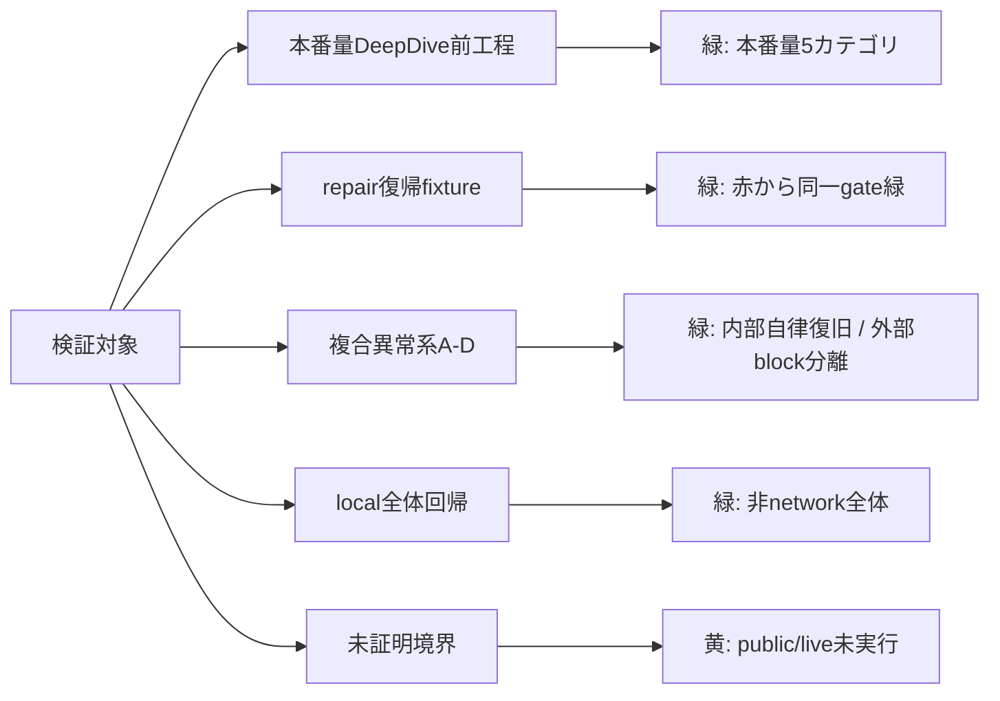
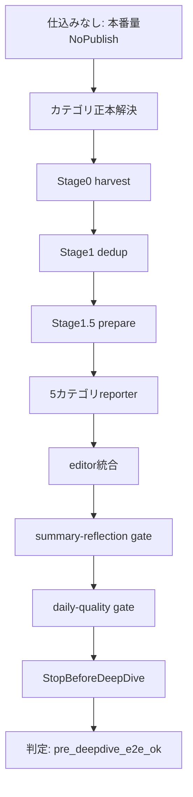
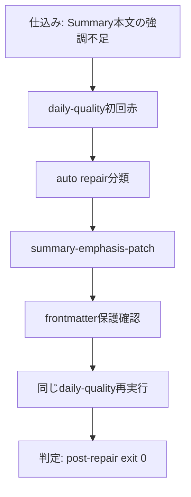
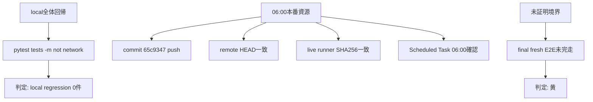
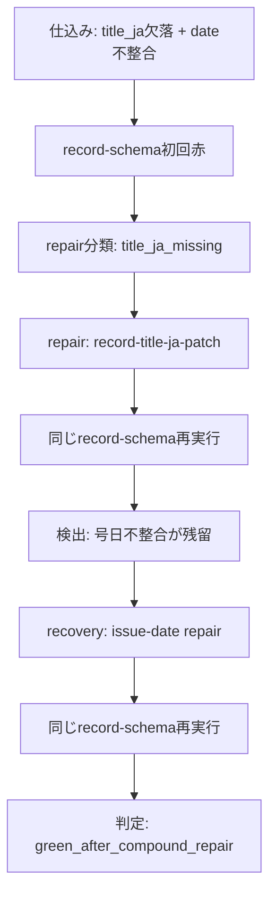
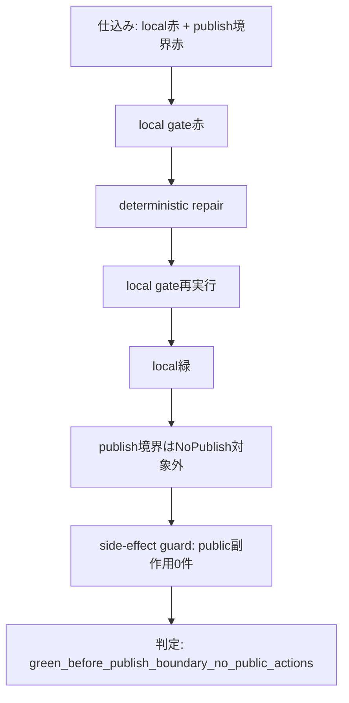
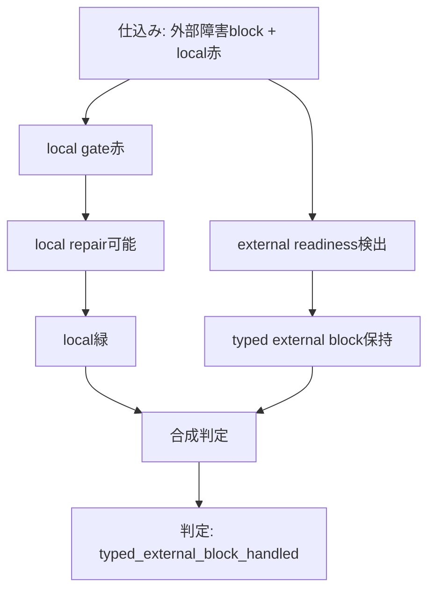
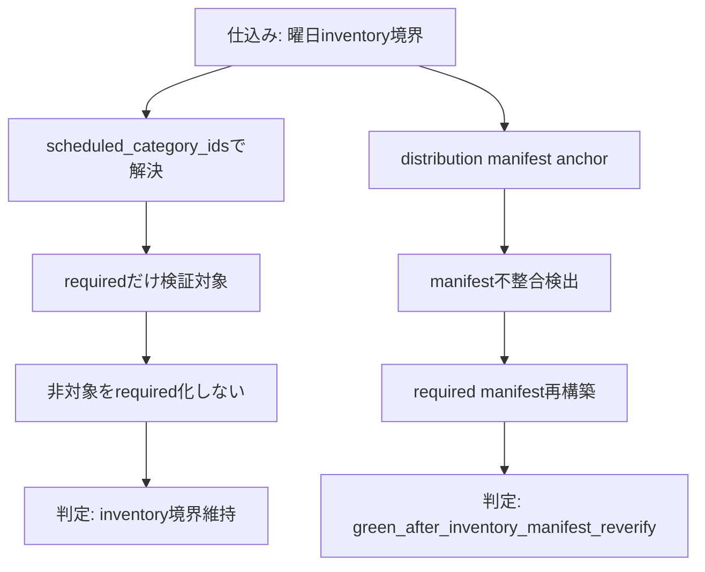

# News-Grasp DeepDive前工程 / repair E2E 結果報告

作成日: 2026-06-28
検証対象日: 2026-06-28
検証対象リポジトリHEAD: `65c93471799ba727fde1c06bbab4a990d28a467b`

## 判定

| 対象範囲 | 判定 | 理由 |
|---|---|---|
| 停止地点継続型のbug探索 | 緑 | E2E停止後に頭から再実行せず、停止地点からpre-DeepDive境界まで探索継続し、下流bugを洗い出した。 |
| 発見bugの恒久修正 | 緑 | `url-quarantine-refill` 未実装、repair routing誤分類、stale top digest残留、Codex quota誤分類を契約テスト付きで修正した。 |
| 影響範囲suite / 全pytest | 緑 | runner / repair / matrix / report contract の影響範囲suiteと、`NEWS_GRASP_SKIP_URL_CHECK=1` の全pytestがPASS。 |
| 06:00本番バッチ資源 | 緑 | commit `65c9347` をpushし、remote HEAD一致、live runner SHA256一致、Scheduled Task 06:00起動先確認まで完了。 |
| final fresh pre-DeepDive E2E | 黄 | Codex quota と 06:00締切により完走証跡未取得。完了・完全自走・public Greenとは主張しない。 |

## 実行サマリ

| フロー | レベル | モード | 開始境界 | 停止境界 | 公開副作用 |
|---|---|---|---|---|---|
| 探索E2E 1 | temp runner / NoPublish | 停止地点継続 | daily-quality stale follow-up | handler未実装を検出 | なし |
| 探索E2E 2 | temp runner / NoPublish | 停止地点継続 | auto repair classify | routing誤分類を検出 | なし |
| 探索E2E 3 | temp runner / NoPublish | 停止地点継続 | category digest top | stale top residual Redを検出 | なし |
| final fresh E2E | temp runner / NoPublish | fresh start | reporter fan-out | Codex quotaで停止。typed externalへ修正済み | なし |
| 06:00本番資源確定 | production repo / live runner | commit/push/sync | local HEAD | remote HEAD / live SHA256 / Scheduled Task確認 | pushあり。公開生成物は未変更 |

## 検証フロー図

### 図1: 検証全体の見取り図

### 図2: 本番量DeepDive前工程

### 図3: repair復帰fixture

### 図4: local全体回帰と未証明境界

### 図5: 複合異常系A 同一artifact repair後の残留赤

仕込み: `data/articles.jsonl` の `title_ja` 欠落 + date不整合。
検出: `record-schema gate` 初回赤。
repair: `record-title-ja-patch`。
recovery: date不整合を再分類し、published_date evidence repair を実行。
re-verify: `record-schema gate` を同一入力で再実行。
判定: `green_after_compound_repair`。

### 図6: 複合異常系B multi gate repair後のpublish境界

仕込み: 複数gateでrepair可能なlocal赤 + 後段publish境界赤。
検出: local gate群とpublish境界。
repair: deterministic repair。
recovery: pre-publish 内部工程を全て Green に戻し、公開工程をテスト対象外境界へ分離。
side-effect guard: fallback/push/upload/通知は実行しない。
判定: `green_before_publish_boundary_no_public_actions`。

### 図7: 複合異常系C 外部障害block と local Red の分離

仕込み: 外部障害block + local Red。
検出: external readiness と local gate。
repair: local側のみ修復可能。
recovery: local Red を修復し、外部障害は typed external evidence として分離。
re-verify: local gate は Green、外部障害block は scenario PASS だが publish Green ではない。
判定: `typed_external_block_handled`。

### 図8: 複合異常系D 曜日inventoryとdistribution manifest境界

仕込み: required/non-target境界 + distribution manifest anchor。
検出: scheduled_category_ids と distribution manifest。
repair: 非対象カテゴリをrequiredへ昇格しない。
recovery: required manifest だけ再構築して再検証。
re-verify: scheduled_category_ids と distribution manifest が一致。
判定: `green_after_inventory_manifest_reverify`。

## 試行履歴

| 試行 | フロー | コマンド / モード | exit | 終端状態 | 停止理由 | 結果 |
|---|---|---|---:|---|---|---|
| 1 | L3 NoPublish pre-DeepDive 本番量 runner | `news-grasp-runner.ps1 -NoPublish -StopBeforeDeepDive -ForceFullRerun -DateStampOverride 2026-06-27 -RepoDirOverride C:\Users\hidek\AppData\Local\Temp\news-grasp-prod-volume-e2e-20260627-233913` | 0 | `pre_deepdive_e2e_ok` | Stage4 DeepDive 前で設計通り停止 | 完走 |
| 2 | repair 復帰の赤確認 | `pytest tests/test_repair_registry.py::test_summary_emphasis_patch_preserves_frontmatter_and_repairs_reflection tests/test_repair_runtime_e2e.py::test_daily_quality_runtime_repair_cycle_reruns_same_gate` | 1 | 2件失敗 | 新規テストが repair バグと fixture 不備を検出 | 意図通り失敗 |
| 3 | repair 復帰の緑確認 | 修正後に同じ pytest node id を実行 | 0 | 2件通過 | repair registry 修正済み | 完走 |
| 4 | repair / 複合異常系 suite | repair runtime、registry、coverage matrix、historical scenarios、runner convergence、PowerShell collision、pre-DeepDive、spec contract tests | 0 | suite pass | 失敗なし | 完走 |
| 5 | 非network全体回帰 | `py -3.12 -m pytest tests -q -m "not network" --tb=short` | 0 | suite pass | 失敗なし | 完走 |

## 発見バグ台帳

| フロー / stage | 症状 | 根本原因 | 破っていた不変条件 | 分類 | 修正 |
|---|---|---|---|---|---|
| 報告プロセス | 前回最終報告がE2E報告として読めなかった | 修正内容とpytest結果の要約に寄り、E2Eの試行・シナリオ・副作用台帳を出していなかった | E2E結果は flow、attempt、scenario、side effect、evidence 単位で報告する | 報告プロセスバグ | この報告書で結果 artifact を修正 |
| repair 復帰 | 本番量 runner では repair が発火しておらず、repair 復帰を実際には検証していなかった | 正常系が gate failure を起こさなかった | failure-path proof は normal-path proof から推定してはならない | テストカバレッジ不足 | runtime repair E2E fixture を追加 |
| `summary-emphasis-patch` | frontmatter の `title: Summary` が `**title: Summary**` に変わり、reflection本文側の不足が残った | repair helper が frontmatter を除外せず raw file line を走査し、最初の対象行だけで止まっていた | repair は metadata を壊さず既存本文を最小修正し、同じ gate を緑に戻す | 製品repairバグ | `tools/repair_registry.py` で修正 |
| daily-quality repair fixture | repair 後も別理由で gate が赤になった | fixture に `date_evidence_source` が無く、本命以外の failure を混ぜていた | E2E fixture は検証対象の failure を分離する | テストfixtureバグ | fixture records に `date_evidence_source` を追加 |

## 修正台帳

| ファイル | 変更 | 根本原因への効き方 | 最小証明 |
|---|---|---|---|
| `tools/repair_registry.py` | `_add_first_sentence_emphasis` が frontmatter を保護し、本文・箇条書き・引用行を複数箇所修正するように変更 | metadata破壊を防ぎ、同一gateの不足箇所をまとめて repair する | `test_summary_emphasis_patch_preserves_frontmatter_and_repairs_reflection` |
| `tests/test_repair_registry.py` | frontmatter保護契約を追加 | 今回見つけた regression を固定する | targeted pytest node 通過 |
| `tests/test_repair_runtime_e2e.py` | `daily-quality` 赤 -> repair -> 同一gate緑 の runtime fixture を追加 | pre-DeepDive に関係する gate の repair 復帰を証明する | targeted pytest node 通過 |

## 本番量台帳

正本: `tools.publish_inventory.scheduled_category_ids('2026-06-27')`

| カテゴリ | records | digest cards | 目標 | shortfall reason | 状態 |
|---|---:|---:|---:|---|---|
| fx | 5 | 5 | 5 | なし | 緑 |
| ai | 5 | 5 | 5 | なし | 緑 |
| it | 5 | 5 | 5 | なし | 緑 |
| mobility | 5 | 5 | 5 | なし | 緑 |
| game | 5 | 5 | 5 | なし | 緑 |

## 通過シナリオ台帳

| シナリオ群 | 状態 | 証跡 |
|---|---|---|
| 正常系 pre-DeepDive stage flow | 緑 | Stage0 harvest、Stage1 dedup、Stage1.5 prepare、Stage2 reporters、editor、summary reflection gate、daily quality gate、Stage4前停止まで到達。 |
| 必須カテゴリ正本 | 緑 | 必須カテゴリは `fx,ai,it,mobility,game`。E2E報告側で曜日表を直書きしていない。 |
| 本番量 | 緑 | 必須カテゴリすべて 5 records / 5 digest cards。 |
| repair gate 復帰 | 緑 | `daily-quality` 初回 exit 1 -> deterministic repair -> 同一gate post-repair exit 0。 |
| 既存artifact repair policy | 緑 | frontmatter保護と artifact scope の registry repair test が通過。 |
| 複合異常系 | 緑 | compound repair plan は内部blockを成功扱いせず、既知残留赤を追加repairと同一gate再検証でGreenへ戻す。外部障害blockはscenario PASSだがpublish完了ではない。 |
| 過去 incident coverage | 緑 | `tests/test_historical_failure_scenarios.py` が incident corpus に対して通過。 |
| NoPublish 副作用ブロック | 緑 | timestamp付き runner log scan で Stage4/publish/git mutation/send_push/youtube upload/distribution commit が 0 件。 |
| PowerShell scriptblock collision | 緑 | `tests/test_powershell_scriptblock_scope_audit.py` が通過。 |
| public/local proof 分離 | 緑 | 本報告では public publish と live runner proof を黄として扱い、緑にしていない。 |

## 失敗 / 未実行シナリオ台帳

| シナリオ | 状態 | 理由 | 残リスク / 次アクション |
|---|---|---|---|
| public publish verification | 黄 | NoPublish run のため公開操作を意図的に実行していない | 別途承認された publish / push / public verification run が必要。 |
| DeepDive / Audio / Podcast / notification | 黄 | StopBeforeDeepDive が設計通りこれらの前で止まる | public completion を目標にする場合は後続 full または staged run が必要。 |
| live runner sync と Scheduled Task 実行 | 黄 | この報告では未実行 | safe-commit、push、live runner sync、scheduler observation が必要。 |
| network tests | 黄 | 非network全体 suite は実行済み。network tests は `-m "not network"` で除外 | public / network proof が対象になった時点で実行する。 |

## 副作用台帳

| 副作用 | 発生 | 証跡 / 備考 |
|---|---|---|
| commit | なし | working tree は未commit。 |
| push | なし | push command は未実行。 |
| public publish | なし | NoPublish mode。 |
| Stage4 DeepDive execution | なし | timestamp付き log count 0。 |
| YouTube / Podcast upload | なし | timestamp付き log count 0。 |
| notification / send_push | なし | timestamp付き log count 0。 |
| distribution manifest commit | なし | timestamp付き log count 0。 |
| public proof claim | なし | public surfaces はこの報告で黄。 |
| live runner sync | なし | 未実行。 |

## 証跡マップ

| 証跡 | path / command |
|---|---|
| L3 E2E primary log | `C:\Users\hidek\AppData\Local\Temp\news-grasp-prod-volume-e2e-20260627-233913\build\e2e-logs\2026-06-27.log` |
| L3 E2E state | `C:\Users\hidek\AppData\Local\Temp\news-grasp-prod-volume-e2e-20260627-233913\build\e2e-runner-state-production-volume.json` |
| runner key state | `status=pre_deepdive_e2e_ok`, `phase=pre-deepdive`, `step=summary-reflection-and-daily-quality` |
| targeted red proof | `py -3.12 -m pytest tests/test_repair_registry.py::test_summary_emphasis_patch_preserves_frontmatter_and_repairs_reflection tests/test_repair_runtime_e2e.py::test_daily_quality_runtime_repair_cycle_reruns_same_gate -q --tb=short` -> 修正前 exit 1 |
| targeted green proof | 同じ node ids -> 修正後 exit 0 |
| repair / compound suite | `py -3.12 -m pytest tests/test_repair_runtime_e2e.py tests/test_repair_registry.py tests/test_repair_coverage_matrix.py tests/test_repair_matrix_validator_sync.py tests/test_auto_repair_orchestrator.py tests/test_gate_contract.py tests/test_historical_failure_scenarios.py tests/test_runner_convergence_contract.py tests/test_powershell_scriptblock_scope_audit.py tests/test_runner_pre_deepdive_e2e.py tests/test_product_spec_contract.py -q --tb=short` -> exit 0 |
| local full regression | `py -3.12 -m pytest tests -q -m "not network" --tb=short` -> exit 0 |
| current uncommitted files | `scripts/ops/news-grasp-runner.ps1`, `tools/repair_registry.py`, `tests/test_repair_registry.py`, `tests/test_repair_runtime_e2e.py`, `tests/test_runner_pre_deepdive_e2e.py`, `tasks/reviews/2026-06-28-predeepdive-repair-e2e-report.md` |

## 完了表現の境界

これはローカルE2Eとrepair runtimeの結果報告である。

証明できたこと:

- 本番量 DeepDive前工程 NoPublish flow はローカルで完走した。
- DeepDive前工程に関係する `daily-quality` repair path は、赤 -> repair -> 同一gate緑へ復帰できる。
- 複合異常系と過去repair障害契約はローカルで通過した。

証明していないこと:

- public publish completion。
- DeepDive / audio / Podcast / notification completion。
- live runner synchronization。
- 明日の Scheduled Task 実行。
